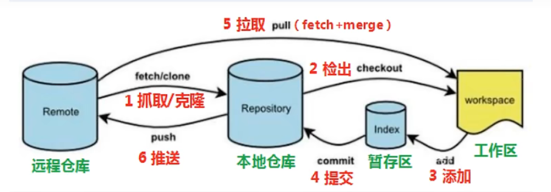
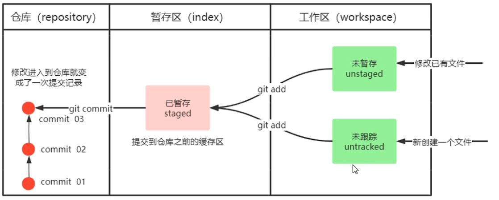
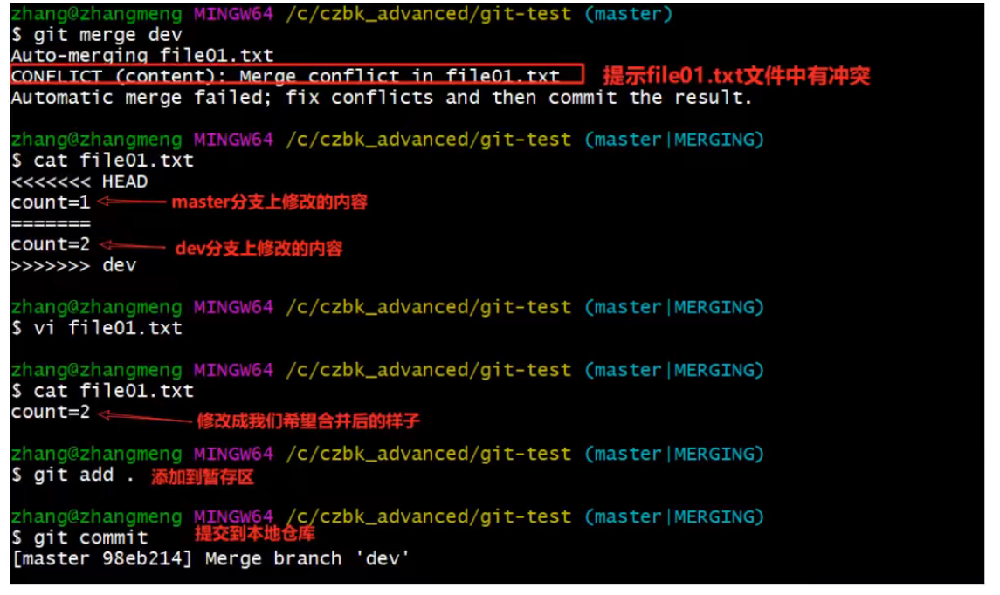
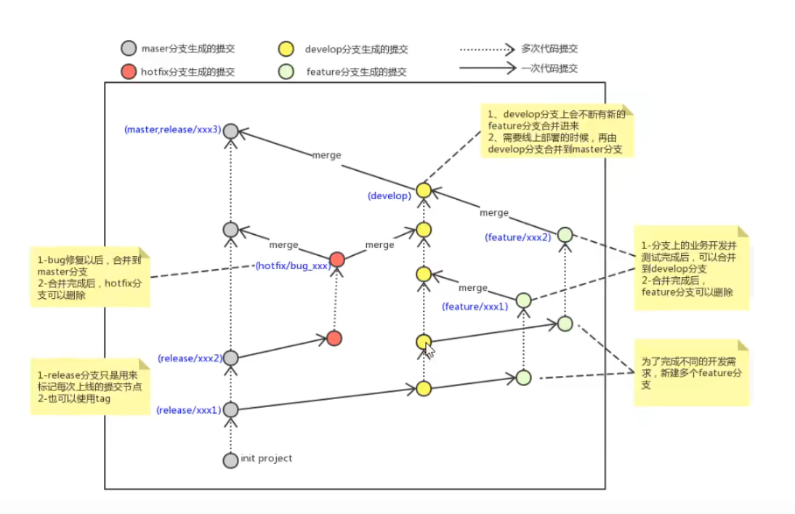
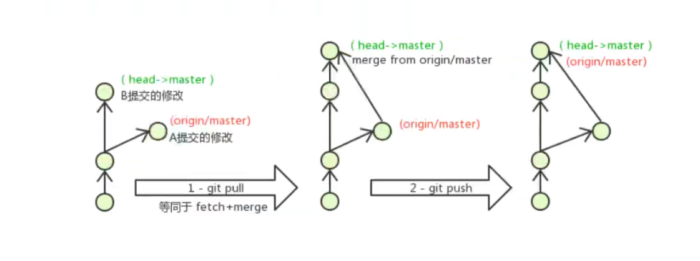

# git工具

## 1.git入门
>总结：
>- 基本操作类：
>- 初始化git                    `git init`
>- 工作区->暂存区         `git add .`
>- 暂存区->仓库            `git commit -m 'commit message 01'`
>- 查看状态                  `git status`
>- 查看提交记录           ` git log`          `git-log`
>- 版本回退                  `git reset --hard commitID`
>- 分支切换类：
>- 查看分支                  `git branch`
>- 切换分支                   `git checkout 分支名`
>- 创建并且切换分支    `git checkout -b 分支名`
>   - `分支合并                  `git merge 分支名`
>   - 首先切换到主分支上
>     远程操作类：
>- 克隆远程仓库            `git clone 远程地址 本地地址`
>- 拉取远端仓库修改并且合并
>- `git pull`
>- 推送本地仓库的修改到远端分支
>- `git push [--set-upstream] origin 分支名`
> - --set-upstream表示和远端分支帮的关联关系，只有第一次推送时需要绑定



命令如下：

1.clone(克隆)：从远程仓库中克隆代码到本地仓库
2.checkout(检出)：从本地仓库中检出一个分支然后进行修订
3.add(添加)：在提交前先将代码提交到暂存区
4.commit(提交)：提交到本地仓库，本地仓库中保存修改的各个历史版本
5.fetch(抓取)：从远程库，抓取到本地仓库，不进行任何的合并动作，一般很少用。
6.pull(拉取)：从远程拉倒本地库，自动进行合并(merge),然后放到工作区，相当于fetch+merge
7.push(推送)：修改完成后，需要和团队成员共享代码时，将代码推送到远程仓库。

### 1.1通用命令
用linux通用的基础操作：
- ls/ll    查看当前目录
- cat     查看文件内容
- touch 创建文件
- vi   vi编辑器 

Git GUI：Git提供的图像界面工具
Git Bash：Git提供的命令行工具

### 1.2基本配置
配置名称和地址：
git config --global user.name"用户名"
git config --global user.email"电子邮箱@qq.com"
查看名称和地址：
git config --global user.name
git config --global user.email
### 1.3获取本地仓库
要用Git对我们的代码进行版本控制，首先需要获得本地仓库
1. 在电脑的任意位置创建一个空目录
2. 在这个目录中，右键打开git bash窗口
3. 执行git init
4. 创建成功后会在该目录下看到隐藏的.git目录
### 1.4基础操作指令
Git工作目录下对于文件的**修改**(增加，删除，更新)会存在几个状态，这些修改的状态会随着我们的执行Git的命令而发生变化。

（工作目录：指定目录下除了.git文件夹以外的内容。）

 

不同状态的转换指令：
1. git add          (工作区-->暂存区)
2. git commit    (暂存区-->本地仓库)
#### 1.4.1\*查看修改的状态(status)
- 作用：查看的修改的状态(暂存区、工作区)
- 命令形式：git status
#### 1.4.2\*添加工作区到暂存区(add)
- 作用：添加工作区的一个或多个文件的修改到暂存区
- 命令形式：git add 单个文件名
- 	      git add 通配符
- 如： git add .
#### 1.4.3\*提交暂存区到本地仓库(commit)
- 作用：提交暂存区的内容到本地仓库的当前分支
- 命令形式：git commit -m '注释内容'
#### 1.4.4\*查看提交日志(log)
- 作用：查看提交记录
- 命令形式：git log[option]
	- options
		- --all 显示所有分支
		- --pretty=oneline 将提交信息显示为一行
		- --abbrev-commit 使得输出的commitID更简短
		- --graph 以图的形式显示
- 命令形式：git -log
修改过的集成显示模式
#### 1.4.5版本回退
- 作用：版本回退
- 命令形式：git reset --hard commitID
	- commitID 可以使用git log指令查看
- 如何查看已经删除的记录？
	- git reflog
	- 这个指令可以看到已经删除的提交记录

#### 1.4.6添加文件至忽略列表
一般我们总会有些文件无需纳入Git的管理，也不希望他们总出现在未跟踪文件列表。通常都是些自动生成的文件，比如日志文件，或者编译过程中创建的临时文件等  。在这种情况下，我们可以在工作目录中创建一个名为.gitignore的文件(文件名固定),列出要忽略的文件格式。下面是一个示例：

```
# no.files
*.a
# but do track lib.a even though you're ignoring .a files above
!lib.a
# only ignore the TODO file in the current directory,not subdir/TODO
/TODO
# ignore all files in the build/ directory
build/
# ignore doc/notes.txt, but not doc/server/arch.txt
doc/*.txt
# ignore all .pdf files in the doc/ directory doc/**/*.pdf
```

## 2.分支
几乎所有的版本控制系统都以某种形式支持分支。使用分支意味着你可以把你的工作从开发主线上分离开来进行总打的Bug修改、开发新的功能，以免影响开发主线。
### 2.1 看本地分支
- 命令：git branch
### 2.2 创建本地分支
- 命令：git branch 分支名
### 2.3 \*切换分支(checkout)
- 命令 ：git checkout  分支名
我们还可以直接切换到一个不存在的分支(创建并切换)
- 命令：git checkout -b 分支名
### 2.3 \*合并分支(merge)
一个分支上的提交可以合并到另一个分支
命令：git merge 分支名称
### 2.4 删除分支
- **不能删除当前分支，只能删除其他分支**
git branch -d b1 删除分支时，需要做各种检查
git branch -D b 1 不做任何检查，强制删除

### 2.5 解决冲突
当两个分支上对文件的修改啃会存在冲突，例如同时修改了同一个文件的同一行，这时就需要手动解决冲突，解决冲突步骤如下：
1. 处理文件中冲突的地方
2. 将解决完冲突的文件加入暂存区(add)
3. 提交到仓库(commit)
    冲突部分的内容处理如下所示：

  

### 2.7 开发中分支使用的原则与流程
几乎所有的版本控制系统都已某种形式支持分支。使用分支意味着你可以把你的工作从开发主线上分离开来进行重大的Bug修改、开发新的功能，以免影响开发主线。
在开发中，一般有如下的分支使用原则和流程：

- master(生产)分支
线上分支，主分支，中小规模项目作为线上运行的应用对应的分支；
- develop(开发)分支
是从master创建的分支，一般作为开发部门的主要开发分支，如果没有其他并行开发不同期上线要求，都可以在此版本进行开发，阶段开发完成后，需要是合并到master分支，准备上线。
- feature/xxxx分支
从develop创建的分支，一般是同期并行开发，但不同期上线时创建的分支，分支上的研发完成后合并到develop分支。
- hotfix/分支
从master派生的分支，一般作为线上bug修复使用，修复完成后需要合并到master、test、develop分支。
- 还有一些其他分支，在此不再详述，例如test分支（用于代码测试）、pre分支（预上线分支）等等。



## 3.Git远程仓库


### 3.1 常用托管服务
```
常用托管平台
github 
码云 国内托管平台
gitlab 企业、学校内部网络搭建git私服
```
### 3.2 操作远程仓库
#### 3.2.1 添加远程仓库
- 命令：git remote add 远端名称 仓库路径
    - 远端名称：默认为origin,取决于远端服务器设置
    - 仓库路径：从远端服务器获取此URL
    - 例如：git remote add origin git@github.com:wwwenwen1/Data-structure.git
#### 3.2.2 查看远程仓库
- 命令 git remote
#### 3.2.3 推送到远程仓库
- 命令：git push \[-f] \[--set-upstream] \[远端名称 \[本地分支名] [:远端分支名] ]
  - 如果远程分支名和本地分支名称相同，则可以只写本地分支
    - git push origin master
    - -f 表示强制覆盖
- `--set-upstream` 推送到远端的同时并且建立起和远端分支的关联关系。
  - git push --set-upstream origin master
- 如果**当前分支已经和远端分支关联**，则可以省略分支名和远端名。
  - git push 将master分支推送到已关联的远端分支。
#### 3.2.4 本地分支与远程分支的联系
- 查看关联关系我们可以使用`git branch-vv` 命令
#### 3.2.5 从远程仓库克隆
如果已经有一个远端仓库，我们可以直接clone到本地。
- 命令：`git clone` <仓库路径> [本地目录]
  -本地目录可以省略，会自动生成一个目录
#### 3.2.6 从远程仓库中抓取和拉取
远程仓库分支和本地的分支一样，我们可以进行merge操作，只是需要先把远端仓库里的更新都下载到本地，再进行操作。
- 抓取命令：git fetch \[remote name] [branch name]
  - **抓取指令就是将仓库里的更新都抓取到本地，不会进行合并**
  - 如果不能指定远端名称和分支名，则抓取所有的分支。
- 拉取命令：git pull \[remote name] [branch name]
  - **拉取命令就是将远端仓库的修改拉取到本地并且自动进行合并，等同于fetch+merge**
  - 如果不指定远端名称和分支名，则抓取所有并更新当前分支。

#### 3.2.7 解决合并冲突
在一段时间，A、B用户修改了同一个文件，且修改了同一行位置的代码，此时会发生合并冲突。
A用户在本地修改代码后优先推送到远程仓库，此时B用户在本地修订代码，提交到本地仓库后，也需要推送到远程仓库，此时B用户晚于A用户，**故需要先拉取远程仓库的提交，经过合并后才能推送到远端分支**，如下图所示。



在B用户拉取代码时，因为A、B用户同一段时间修改了同一个文件的相同位置代码，故会发送合并冲突。
**远程分支也是分支，所以合并时冲突的解决方式也和解决本地分支冲突相同**。（同2.5）
先pull后push
## 附:几条铁令
1.切换分支前提交本地的修改
2.代码及时提交，提交过就不会丢
3.遇到任何问题不要删除文件目录
4.

