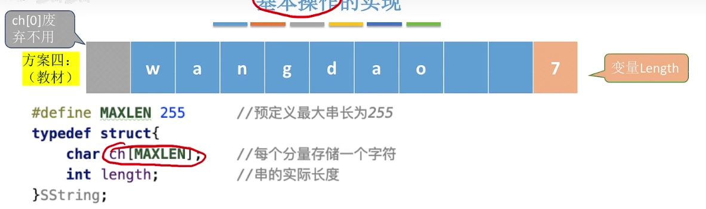

#  KMP算法
KMP的名字是由三位发明它的人的名字命名的。
KMP算法是为了弥补朴素模式匹配算法的缺点：当某些子串与模式串能部分匹配时，**主串的扫描指针i经常回溯**,导致时间开销增加。
所以KMP算法只在**子串与模式串经常出现部分匹配**的时候才会比朴素模式匹配快许多。

## 字符串结构的实现
由于c语言不存在字符串这种数据结构，只存在字符数组。
所以字符串这种数据结构可以自己定义。
王道教材使用的实现字符串的数据结构是：


这样一种格式，代码为：
```c
#define MAXLEN 255		//预定义最大串长为255
typedef struct{
char ch[MAXLEN];		//每个分量存储一个字符
int length;				//串的实际长度
}SString;
```
这种还是使用数组来实现字符串，但是**字符串的下标与位数是一一对应的(舍弃了第一个位置)**，而且结构中包含了字符串的长度。
## 补充知识
1. 前缀
所有含第一个字符，但不含最后一个字符的子串。
2. 后缀
所有含最后一个字符，但不含第一个字符的子串。
3. 部分匹配值
字符串的前缀和后缀的**最长相等前后缀的长度**。
4. **部分匹配值表(Partial Match,PM)**
用部分匹配值形成的表。
例如：
>'a'的前缀和后缀都为空集，最长相等前后缀为{∅}，部分匹配值为0，
>部分匹配值形成的表为：
>| a |
>| 0 |

>'ab'的前缀为{a}，后缀为{b}，最长相等的前后缀为{∅}，部分匹配值为0，
>部分匹配值形成的表为：
>| a | b |
>| 0 | 0 |

>'aba'的前缀为{a,ab}，后缀为{ba,a}，最长相等前后缀为{a}，部分匹配值为1，
>部分匹配值形成的表为：
>| a | b | a |
>| 0 | 0 | 1 |

>'abab'的前缀为{a,ab,aba}，后缀为{bab,ab,a}，最长相等前后缀为{ab}，部分匹配值为2，
>部分匹配值形成的表为：
>| a | b | a | b |
>| 0 | 0 | 1 | 2 |

>'ababa'的前缀为{a,ab,aba,abab}，后缀为{baba,aba,ba,a}，最长相等前后缀为{aba}，长度为3，
>部分匹配值形成的表为：
>| a | b | a | b | a |
>| 0 | 0 | 1 | 2 | 3 |

## KMP原理
利用next数组来进行跳跃式的匹配。
## next数组

next数组有两种:

```
第一种:
整体加一
以0开头，适用于串的位序是从1开始的
第二种:
整体没有加一
以-1开头，适用于串的位序是从0开始的
```

以下拿整体加一的举例，考试时两种都可能遇到：

### next数组手算

1. 手算法：
由前`1`~`j-1`个字符组成的串计为S,则：
`next[j]=S的最长相等前后缀长度+1`
特别的，`next[1]=0`
2. PM表法：
例如对式子`aabaabaaa`求PM表,让`j`位于第一位，`i`位于第二位
第一步，先求PM表
```
1
| j | i |   |   |   |   |   |   |   |	
| a | a | b | a | a | b | a | a | a |	模式串
| 0 | 1 |   |   |   |   |   |   |   |	PM表
| 0 | 1 | 2 | 3 | 4 | 5 | 6 | 7 | 8 |	模式串下标
```
比较`j`与`i`对应的字符：
如果相等，就使得`i`字符下面的数值变为`j`的下标，然后把`i`和`j`都往后移一位；
如果不相等，就让`j`指向`next[j]`，重新开始比较；当`PM[j]=1`时，如果还不相等，就让`i`往后移一位。

```
2
|   | j | i |   |   |   |   |   |   |	
| a | a | b | a | a | b | a | a | a |	模式串
| 0 | 1 | 0 |   |   |   |   |   |   |	PM表
| 0 | 1 | 2 | 3 | 4 | 5 | 6 | 7 | 8 |	模式串下标
```
`j`和`i`不匹配，让`j=next[j]`，重新开始匹配。
```
3
| j |   | i |   |   |   |   |   |   |	
| a | a | b | a | a | b | a | a | a |	模式串
| 0 | 1 | 0 | 1 |   |   |   |   |   |	PM表
| 0 | 1 | 2 | 3 | 4 | 5 | 6 | 7 | 8 | 	模式串下标
```
`j==1``i`和`j`还是不相等，让`i`往后移动一位。
```
4
| j |   |   | i |   |   |   |   |   |	
| a | a | b | a | a | b | a | a | a |	模式串
| 0 | 1 | 0 | 1 |   |   |   |   |   |	PM表
| 0 | 1 | 2 | 3 | 4 | 5 | 6 | 7 | 8 | 	模式串下标
```
`j`和`i`匹配，`PM[i]+1=j`,`j++`,`i++`。

```
5
|   | j |   |   | i |   |   |   |   |	
| a | a | b | a | a | b | a | a | a |	模式串
| 0 | 1 | 0 | 1 | 2 |   |   |   |   |	PM表
| 0 | 1 | 2 | 3 | 4 | 5 | 6 | 7 | 8 | 	模式串下标
```
`j`和`i`匹配，`PM[i]+1=j`,`j++`,`i++`。

```
6
|   |   | j |   |   | i |   |   |   |	
| a | a | b | a | a | b | a | a | a |	模式串
| 0 | 1 | 0 | 1 | 2 | 3 |   |   |   |	PM表
| 0 | 1 | 2 | 3 | 4 | 5 | 6 | 7 | 8 |	模式串下标
```
`j`和`i`匹配，`PM[i]+1=j`,`j++`,`i++`。

```
7
|   |   |   | j |   |   | i |   |   |	
| a | a | b | a | a | b | a | a | a |	模式串
| 0 | 1 | 0 | 1 | 2 | 3 | 4 |   |   |	PM表
| 0 | 1 | 2 | 3 | 4 | 5 | 6 | 7 | 8 |	模式串下标
```
`j`和`i`匹配，`PM[i]+1=j`,`j++`,`i++`。

```
8
|   |   |   |   | j |   |   | i |   |	
| a | a | b | a | a | b | a | a | a |	模式串
| 0 | 1 | 0 | 1 | 2 | 3 | 4 | 5 |   |	PM表
| 0 | 1 | 2 | 3 | 4 | 5 | 6 | 7 | 8 |	模式串下标
```
`j`和`i`匹配，`PM[i]=j`,`j++`,`i++`。

```
9
|   |   |   |   |   | j |   |   | i |	
| a | a | b | a | a | b | a | a | a |	模式串
| 0 | 1 | 0 | 1 | 2 | 3 | 4 | 5 |   |	PM表
| 0 | 1 | 2 | 3 | 4 | 5 | 6 | 7 | 8 |	模式串下标
```
`j`和`i`不匹配，`j=next[j-1]`

```
10
|   |   | j |   |   |   |   |   | i |	
| a | a | b | a | a | b | a | a | a |	模式串
| 0 | 1 | 0 | 1 | 2 | 3 | 4 | 5 |   |	PM表
| 0 | 1 | 2 | 3 | 4 | 5 | 6 | 7 | 8 |	模式串下标
```
`j`和`i`还是不匹配，`j=next[j-1]`
```
11
|   | j |   |   |   |   |   |   | i |	
| a | a | b | a | a | b | a | a | a |	模式串
| 0 | 1 | 0 | 1 | 2 | 3 | 4 | 5 |   |	PM表
| 0 | 1 | 2 | 3 | 4 | 5 | 6 | 7 | 8 |	模式串下标
```
```
12
|   | j |   |   |   |   |   |   | i |	
| a | a | b | a | a | b | a | a | a |	模式串
| 0 | 1 | 0 | 1 | 2 | 3 | 4 | 5 | 2 |	PM表
| 0 | 1 | 2 | 3 | 4 | 5 | 6 | 7 | 8 |	模式串下标
```
求出PM表后，把**PM表整体向右平移一个单位，最左边空出来的`PM[1]=-1`，然后整体再加一**，就得到了next数组。
```
| 0 | 1 | 0 | 1 | 2 | 3 | 4 | 5 | 2 |  PM表
| 0 | 1 | 2 | 1 | 2 | 3 | 4 | 5 | 6 |  next数组
```
3. 机算法：
当`j=0`或者`pattern[j]=pattern[i]`时，`i++`，`j++`，且`next[i]=j`
其他情况下，`j=next[j]`。
机算法和PM表法很像，但
机算法通过对齐下标（使得值+1）和 先判断 然后自增与赋值 （使得数组向右移动一位）来实现了PM表法求next数组两步的融合。
```
1
| j | i |   |   |   |   |   |   |   |   |	
|   | a | a | b | a | a | b | a | a | a |	模式串 pattern[]
|   | 0 | 1 |   |   |   |   |   |   |   |	next数组
| 0 | 1 | 2 | 3 | 4 | 5 | 6 | 7 | 8 | 9 |   模式串下标
```
`j=0`，`i++`，`j++`，让`next[i]=j`。

```
2
|   | j | i |   |   |   |   |   |   |   |	
|   | a | a | b | a | a | b | a | a | a |	模式串 pattern[]
|   | 0 | 1 |   |   |   |   |   |   |   |	next数组
| 0 | 1 | 2 | 3 | 4 | 5 | 6 | 7 | 8 | 9 |   模式串下标
```
`pattern[i]=pattern[j]`，`i++`，`j++`，让`next[i]=j`。
```
3
|   |   | j | i |   |   |   |   |   |   |	
|   | a | a | b | a | a | b | a | a | a |	模式串
|   | 0 | 1 | 2 |   |   |   |   |   |   |	next数组
| 0 | 1 | 2 | 3 | 4 | 5 | 6 | 7 | 8 | 9 |   模式串下标
```
`j`不为0，`pattern[i]`不等于`pattern[j]`，属于其他情况，让`j=next[j]`
`j`变为指向`next[2]=1`
```
4
|   | j |   | i |   |   |   |   |   |   |	
|   | a | a | b | a | a | b | a | a | a |	模式串
|   | 0 | 1 | 2 |   |   |   |   |   |   |	next数组
| 0 | 1 | 2 | 3 | 4 | 5 | 6 | 7 | 8 | 9 |   模式串下标
```
`j`不为0，`pattern[i]=a`不等于`pattern[j]=b`，属于其他情况，让`j=next[j]`
`j`变为指向`next[1]=0`
```
5
| j |   |   | i |   |   |   |   |   |   |	
|   | a | a | b | a | a | b | a | a | a |	模式串
|   | 0 | 1 | 2 |   |   |   |   |   |   |	next数组
| 0 | 1 | 2 | 3 | 4 | 5 | 6 | 7 | 8 | 9 |   模式串下标
```
`j=0`，`i++`，`j++`，让`next[i]=j`。
```
6
|   | j |   |   | i |   |   |   |   |   |	
|   | a | a | b | a | a | b | a | a | a |	模式串
|   | 0 | 1 | 2 | 1 |   |   |   |   |   |	next数组
| 0 | 1 | 2 | 3 | 4 | 5 | 6 | 7 | 8 | 9 |   模式串下标
```
`pattern[i]=pattern[j]`，`i++`，`j++`，让`next[i]=j`。
```
7
|   |   | j |   |   | i |   |   |   |   |	
|   | a | a | b | a | a | b | a | a | a |	模式串
|   | 0 | 1 | 2 | 1 | 2 |   |   |   |   |	next数组
| 0 | 1 | 2 | 3 | 4 | 5 | 6 | 7 | 8 | 9 |   模式串下标
```
`pattern[i]=pattern[j]`，`i++`，`j++`，让`next[i]=j`。
```
8
|   |   |   | j |   |   | i |   |   |   |	
|   | a | a | b | a | a | b | a | a | a |	模式串
|   | 0 | 1 | 2 | 1 | 2 | 3 |   |   |   |	next数组
| 0 | 1 | 2 | 3 | 4 | 5 | 6 | 7 | 8 | 9 |   模式串下标
```
`pattern[i]=pattern[j]`，`i++`，`j++`，让`next[i]=j`。
```
9
|   |   |   |   | j |   |   | i |   |   |	
|   | a | a | b | a | a | b | a | a | a |	模式串
|   | 0 | 1 | 2 | 1 | 2 | 3 | 4 |   |   |	next数组
| 0 | 1 | 2 | 3 | 4 | 5 | 6 | 7 | 8 | 9 |   模式串下标
```
`pattern[i]=pattern[j]`，`i++`，`j++`，让`next[i]=j`。
```
10
|   |   |   |   |   | j |   |   | i |   |	
|   | a | a | b | a | a | b | a | a | a |	模式串
|   | 0 | 1 | 2 | 1 | 2 | 3 | 4 | 5 |   |	next数组
| 0 | 1 | 2 | 3 | 4 | 5 | 6 | 7 | 8 | 9 |   模式串下标
```
`pattern[i]=pattern[j]`，`i++`，`j++`，让`next[i]=j`。

```
11
|   |   |   |   |   |   | j |   |   | i |	
|   | a | a | b | a | a | b | a | a | a |	模式串
|   | 0 | 1 | 2 | 1 | 2 | 3 | 4 | 5 | 6 |	next数组
| 0 | 1 | 2 | 3 | 4 | 5 | 6 | 7 | 8 | 9 |   模式串下标
```
`pattern[i]=pattern[j]`，`i++`，`j++`，让`next[i]=j`。

完成。

### next数组机算
next机算是由手算优化得来的：
```c
int* getNext(SString pattern){
    int* next=(int*)malloc(sizeof(int)*(pattern.length+1));//next数组的长度为模式串长度+1,因为next[0]废弃不用
    next[0]=-1;//next[0]废弃不用，因为要和模式串对齐.
    next[1]=0;//next[1]的值为0，pm表中为-1,整体加一后变为0
    int i=1;
    int j=0;
    while(i<pattern.length){//i<pattern.length说明模式串还没有遍历完
        if(j==0||pattern.ch[i]==pattern.ch[j]){//模式串的第i个字符和第j个字符匹配时，或者j=0时,(j=0说明模式串的第一个字符和主串的第i个字符不匹配，所以j要回溯)
            i++;
            j++;
            next[i]=j;//让next[i]的值等于j,开始回溯.(示在i位置匹配失败时，让模式串的第j个字符和主串的第i个字符开始匹配)
        }else{
            j=next[j];//如果不匹配,j值回溯
        }
    }
    return next;式串下标
```

## KMP算法的进一步优化
next数组某些回溯的时候不够彻底，往往需要毫无意义的连续回溯几次才能完成(如计算法演示的3，4，5步骤)，但这是可以避免的，因此有了进一步优化的空间。优化思路就是找出这些连续的跳转回溯，把他们变成一步到位的回溯。
例如串`ababaaababaa`:
```
| a | b | a | b | a | a | a | b | a | b | a | a |   模式串
| 0 | 1 | 1 | 2 | 3 | 4 | 2 | 2 | 3 | 4 | 5 | 6 |	next数组
| 1 | 2 | 3 | 4 | 5 | 6 | 7 | 8 | 9 | 10| 11| 12|	下标
```

### nextval数组
```c
nextval[1]=0;
for(int j=2;j<=T.length;j++){
	if(T.ch[ next[j] ]==T.ch[j]){
		nextval[j]=nextval[next[j]];
	}else{
		nextval[j]=next[j];
	}
}
```