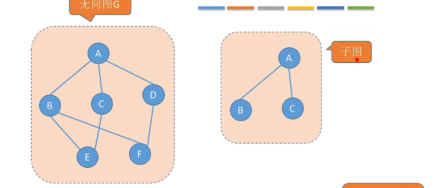
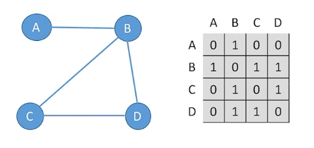
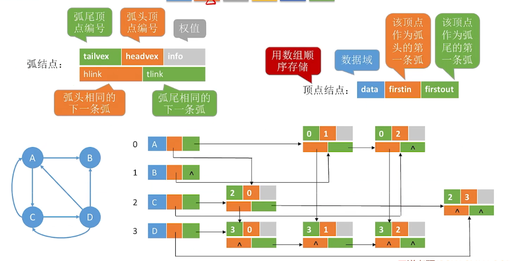
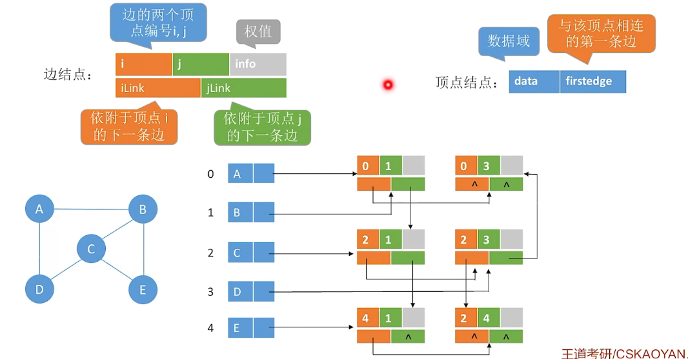
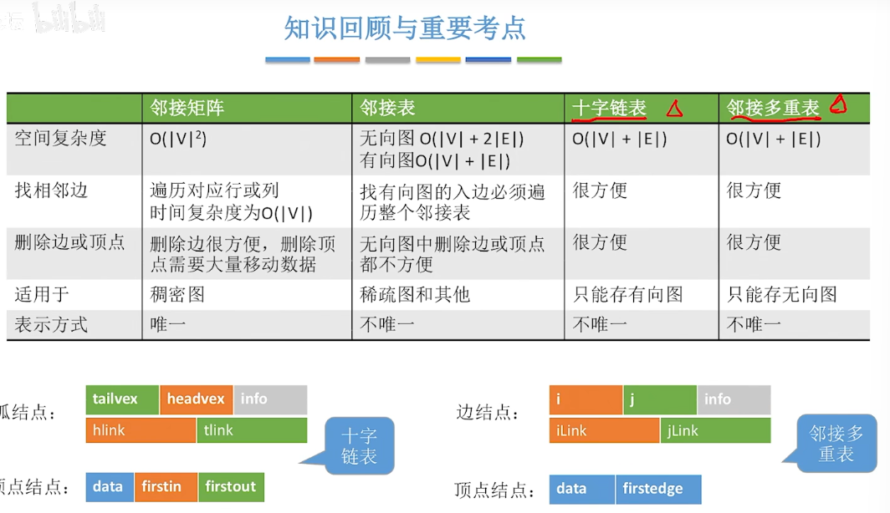
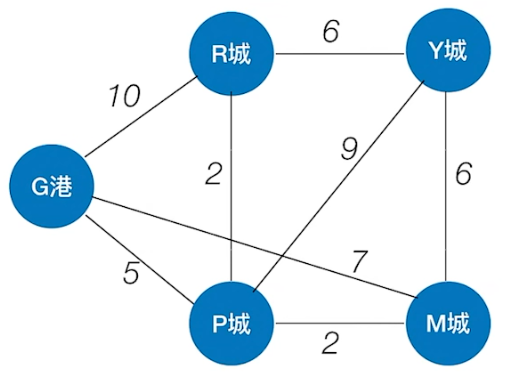
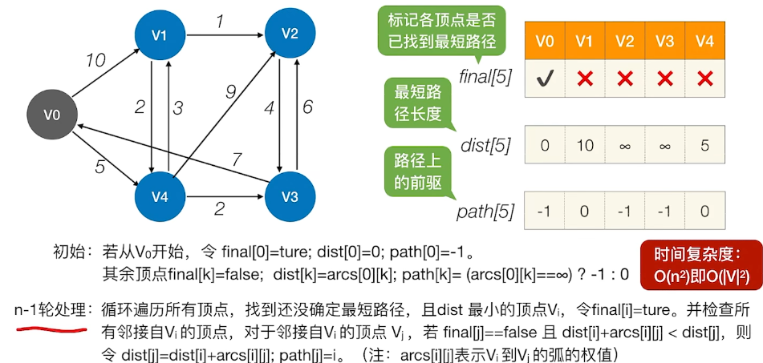
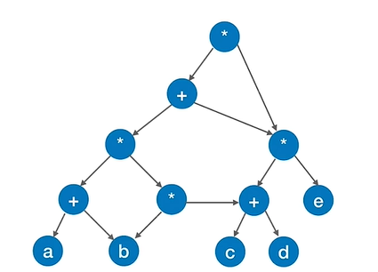

# 6.图
## 6.1 图的定义
### 6.1.1图的定义
图G是由 **顶点集V**和**边集E**组成，记为`G=(V,E)`，其中：
V(G)表示图G中顶点的有限非空集；
E(G)表示图G中顶点之间的关系( 边 )集合。
若V = {V1,V2,V3,....,Vn}，则用 `|V|` 表示图G中顶点的个数，也称图G的阶，`E={(u,v)|u∈V,v∈V}`,用`|E|`表示图G中边的条数。

>注意：图不能为空，没有空图一说，图一定有顶点（ V ≠ ∅），但可以没有边（E＝∅ ）。

### 6.1.2 无向图、有向图
若E是无向边的有限集合时，图G为无向图。边是顶点的无序对，记作（v，u）或（u，v），因为（v，w）=（w，v），其中v、w是顶点。可以说顶点w和顶点v互为邻接点。边（v，w）依附于顶点 w 和 v ，或者说边（v , w）和顶点v，w相关联。
```
G=(V,E)
V={A,B,C,D,E}
E={(A,B),(B,D),(B,E),(C,D),(C,E),(D,E),}
```
若E是有向边（也称弧）的有限集合时，则图G为有向图。弧是顶点的有序对，记作`<v,w>`,其中v，w是顶点，v称为弧尾，w称为弧头，`<v,w>`称为从顶点v到顶点w的弧，也称v邻接到w，或w邻接自v。`<v,w>≠<w,v>`
```
G=(V,E)
V={A,B,C,D,E}
E={<A,B>,<B,A>,<A,C>,<A,D>,<A,E>,<B,A>,<>,<>}
```
### 6.1.3 简单图和多重图
简单图(包含简单有向图，简单无向图)
1. 不存在重复的边；
2. 不存在顶点到自身的边；
>多重图(数据结构不讨论)
>允许存在重复的边，允许存在自身到自身的节点。

### 6.1.4 顶点的度，入度，出度
对于无向图：顶点V的度就是指依附于该顶点的边的条数，记为`TD(v)`。
对于有向图：
入度是以顶点v为终点的有向边的数目，记为`ID(v)`;
出度是以顶点v为起点的有向边的数目，记为`OD(v)`。
顶点v的度等于其入度和出度之和，即TD(v)=ID(v)+OD(v)。
### 6.1.5 顶点-顶点的关系描述
- 路径：顶点$V_{p}$到顶点$V_{q}$之间的一条路径是指顶点序列，$V_{p},V_{1},V_{2},.....,V_{m},V_{q}$
- 回路：第一个顶点与最后一个顶点相同的路径称为回路。
- 简单回路：除第一个顶点和最后一个顶点外，其余顶点不重复出现的回路称为简单回路。
- 简单路径：在路径序列中，顶点不重复出现的路径称为简单路径。
- 路径长度：路径上边的数目
- 点到点的距离：从顶点u出发到顶点v的**最短路径**若存在，则**此路径的长度称为从u到v的距离**。若从u 到 v根本不存在路径，则记该距离为无穷（ **∞**）
- 无向图中，若从顶点v到顶点w有路径存在，则称v和w是联通的
- 有向图中，若从顶点v到顶点w和顶点w到顶点v之间都有路径，则称这两个顶点都是强连通的
### 6.1.6 连通图、强连通图

若图中G中任意两个顶点都是连通的，则称图G为连通图，否则称为非连通图。
>1
>连通：任意两个点直接有直接、或间接的连接。
>连通图：任意两点都连通的图
>连通分量：尽可能包含更多点和更多边 的连通子图。(1. 是连通图 2.是原图的子图 3.尽可能多的包含节点)


若图G中任何一对顶点都是强连通的，则称此图为强连通图。

>常见考点：
>对于n个顶点的无向图G,
>若G是连通图，则最少有 n-1条边
>若G是非连通图，则最多可能有$C^{2}_{n-1}$ 条边
>对于n个顶点的有向图G,
>若G是强连通图，则最少有 n 条边（形成回路）

### 6.1.7 研究图的局部----子图


设有两个图G=(V，E)和G'=(V'，E')，若V'是V的子集，且E'是E的子集，则称G'是G的子图。
（子图首先必须是个图，要满足图的定义）

若有满足V(G')=V(G)的子图G'，则称其为G的生成子图
### 6.1.8 连通分量和强连通分量
#### 无向图的连通分量
无向图中的极大**连通子图**称为**连通分量**。

图G和它的三个连通分量$G_{1}、G_{2}、G_{3}$
连通分量要包含尽可能多的节点，和尽可能多的边。
#### 有向图的强连通分量
有向图中的极大**强连通子图**称为有向图的**强连通分量**。


### 6.1.9 生成树和生成森林
#### 生成树
(无向图的)连通图的生成树是包含图中全部顶点的一个极小连通子图。
>包含所有的点，但边要尽可能的少，而且要保持连通。
>n个顶点的连通图，他的生成树有n-1条边。
>生成树没有回路

#### 生成森林
在非连通图中，连通分量的生成树构成了非连通图的生成森林。

### 6.1.10 几种特殊形态的图
#### 树
树是不存在回路，且连通的无向图
n个顶点的树，必有n-1条边
>常见考点：n个顶点的图，若|E|>n-1，则一定有回路

### 有向树
有向树，一个顶点的入度为0、其余顶点的入度均为1的有向图，称为有向树。
>有向树不是强连通图。

## 6.2 图的存储
### 6.2.1 图的存储--邻接矩阵法


用二维矩阵存储，
```c
#define MaxvertexNum 100		//顶点数目的最大值
typedef struct{
//顶点表的下标与边表的下标对应
    char Vex[MaxVertexNum];		//顶点表
    int Edge[MaxVertexNum][MaxVertexNum];//邻接矩阵，边表
    int vexnum,arcnum;			//图的当前顶点树和边数
}MGraph;
```
结点数为`n`的图G=(V，E)的邻接矩阵A是n × n的。将G的顶点编号为$V_{1}、V_{2}、......、V_{n}$，则 $A[ i ][ j ]\begin{cases}1, 若(v_{i},v_{j})或<v_{i},v_{j}>是E(G)中的边 \\0，若(v_{i},v_{j})或<v_{i},v_{j}>不是E(G)中的边 \end{cases}$
>1
>对于有向图，
>求某个节点的入度，遍历他的第 i 行
>求出度遍历他的第 i 列
>求他的度，让出入度数相加

#### 带权图的存储
带权图不用 0 和 1 区别顶点之间是否有连接，用 权值 和 无穷大 来存储（把自己指向自己的权值设为0）

#### 邻接矩阵法的性质***
设图G的邻接矩阵为α（矩阵元素为0/1），则$α^{n}$的元素 $α^{n}[i][j]$ 等于由顶点 i 到顶点 j 的长度为 n 的路径的数目。

$α^{2}[1][4]=α_{1,1}α_{1,4}+α_{1,2}α_{2,4}+α_{1,3}α_{3,4}+α_{1,4}α_{4,4}=1$

>$α^{n}[i][j]$代表α的n次方的
>上式结果为 1 ，代表从A节点($A^{n}[i][j]$中 i 代表的含义)出发到 D 结点($A^{n}[i][j]$中 j 代表的含义)的长度为2($A^{n}[i][j]$中n代表的含义)的路径只有1条(结果为1)

#### 常见考点
- 如何计算指定顶点的度、入度、出度(分无向图、有向图来考虑)？时间复杂度如何？
- 如何找到与顶点相邻的边（入边、出边）?时间复杂度如何？
- 如何存储带权图
- 空间复杂度— —O($|V^{2}|$)，适合存储稠密图
- 无向图的邻接矩阵为对称矩阵，如何压缩存储？
- 设图G的邻接矩阵为A(矩阵元素为0/1)，则$A_{n}$的元素$A_{n}[i][j]$等于由顶点 i 到顶点 j 的长度为n的路径的数目。
### 6.2.2 邻接表
顺序存储+链式存储
与树的孩子表示法相同


```c
//用邻接表存储的图
typedef struct{
    AdjList vertices;
    int vexnum,arcnum;
}ALGraph;

//"顶点"
typedef struct VNode{
VertexType data;	//顶点信息
ArcNode *first;		//第一条边/弧
}VNode,AdjList[MaxVertexNum];

//"边/弧"
typedef struct ArcNode{
    int adjvex;				//边/弧指向哪个结点
    struct ArcNode *next;	//指向下一条弧的指针
    //InforType info;		//边权值
}ArcNode;
```

复杂度：
存储无向图的空间复杂度为：O(|V|+2|E|)每条边被存储两遍
存储有向图的空间复杂度为：O(|V|+|E|)

>图的邻接表表示方式并不唯一

### 6.2.3 十字链表法（存储有向图）
存储有向图



```c
#define MAXSIZE 100

//图结构
typedef struct graph{
    VNode G[MAXSIZE]; 
}Graph;

//图的顶点节点
typedef struct VNode{
    elementType data;	//数据域
    ArcNode* firstin;	//该顶点作为弧头的第一条弧
    ArcNode* firstout;	//该顶点作为弧尾的第一条弧
}VNode;

//图的边节点
typedef struct ArcNode{
    int tailvex;	//弧尾顶点的编号
    int headvex;	//弧头顶点的编号
    //int info;		//边的权值
    ArcNode* hlink;	//弧头相同的下一条弧
    ArcNode* tlink;	//弧尾相同的下一条弧
}ArcNode;

```

### 6.2.4 邻接多重表（存储无向图）
存储无向图

结合了邻接表和十字链表法，



```c
#define MAXSIZE 100

//图结构
typedef struct graph{
    VNode G[MAXSIZE]; 
}Graph;

//图的顶点节点
typedef struct VNode{
    elementType data;	//数据域
    ArcNode* firstedge;	//该顶点相连的的第一条边
}VNode;

//图的边节点
typedef struct ArcNode{
    int i;	//起始顶点的编号
    int j;	//起始顶点的编号
    //int info;		//边的权值
    ArcNode* ilink;	//依附于i顶点的下一条边
    ArcNode* jlink;	//依附于j顶点的下一条边
}ArcNode;
```
### 总结


## 6.3 图的基本操作和遍历
### 6.3.1 基本操作
### 6.3.2 遍历
#### 广度优先遍历 BFS
广度优先搜索遍历图的过程是以v为起始点，依次访问和v有路径相通的顶点W1，W2，W3····，然后再依次访问与W1，W2，W3，···有路径相通的节点。
该算法不是递归算法，为了实现逐层访问的访问，算法需要借助一个**辅助队列**，以记忆正在访问的顶点的下一层顶点。

代码如下：

主要分为以下几个步骤：

1. 创建队列，找到起始节点的第一个邻居节点并入队。
2. 让该节点出队，以该邻居节点为主人节点，寻找它的邻居节点并依次入队。
3. 当遍历完所有该主人节点的邻居节点时，把队头节点作为下一个主人节点，并重复2、3步，直到队列为空。

```c
void BFS(Graph G, char start){
    LinkQueue Q=(LinkQueue)malloc(sizeof(struct Queue));
    initQueue(Q);
    int visited[MAX]={0};
    int startNum=LocateVex(G,start);
    enQueue(Q,start);
    visited[startNum]=1;
    while(!QueueisEmpty(Q)){//队列为空代表遍历完所有与start连通的节点
        char host=deQueue(Q);//队首出队列，然后把与其相邻的节点入队列
        printf("%c ",host);
        int hostNum=LocateVex(G,host);
        char neighbor=FirstNeighbor(G,host);//获取队首的第一个邻接点
        int neighborNum=LocateVex(G,neighbor);
        char firstNeithbor=neighbor;//记录第一个邻接点,当遍历到第一个邻接点时，说明已经遍历完所有与host相邻的节点
        while(neighbor!=ERROR){//邻节点不存在时终止循环，该条件会在1.队首没有邻接点时触发firstNeighbor==ERROR 2.遍历完队首唯一的邻接点时触发NextNeighbor==ERROR
            if(visited[neighborNum]==0){//如果该邻接点没有被访问过，就入队列,并且标记为已访问
                enQueue(Q,neighbor);
                visited[neighborNum]=1;
            }
            neighbor=NextNeighbor(G,host,neighbor);//获取下一个邻接点
            neighborNum=LocateVex(G,neighbor);//获取下一个邻接点的下标
            if(neighbor==firstNeithbor)//如果遍历到第一个邻接点，说明已经遍历完所有与host相邻的节点
                break;
        }
    }
    //如果遍历完所有与start连通的节点，但是还有未被访问的节点，就从该节点开始继续遍历
    //以下用于遍历与start不连通的节点
    int i=0;
    while(i<G.vexnum){//如果有未被访问的节点，就从该节点开始继续遍历
        if(visited[i]==0){
            BFS(G,G.vexs[i]);
        }
        i++;
    }
}

```

#### 深度优先遍历 DFS


## 6.4 图的应用
### 6.4.1 最小生成树
连通图才有最小生成树，连通图的最小生成树就是减少边的数量到最少，但还使所有结点保持连通的子图。
#### 6.4.1.1 Prim算法
普里姆算法就是从某个点开始，然后寻找与其相连的权值最小的边，然后加入到子图的算法。不断重复就能找到最小生成树。

时间复杂度：O($|V|^{2}$) 适合用于**边稠密图**
#### 6.4.1.2 kruskal算法
克鲁斯卡尔算法，每次选择一条权值最小的边，使这条边的两头连通（原本就连通的就不选），直到所有结点都连通。

时间复杂度：O($|E|log_{2}|E|$) 适合用于**边稀疏图**
### 6.4.2 最短路径



考研常考：
1. 单源最短路径问题

>BFS算法（无权图）
>Dijkstra算法（无权图、带权图）

2. 每对顶点间的最短路径
>Floyd算法（带权图、无权图）

#### 6.4.2.1 BFS算法（无权图）
对BFS的进行小修改即可得到BFS求最短路径算法：


添加两个数组`d[]`和`path[]`，`d[]`用来记录其余顶点与输入顶点的最小距离，`path[]`用来记录该结点的前驱结点。

`d[]的初始值都为 ∞ (无穷大)`，每遍历一个结点，如果`d[]`变得更小，就应用它。直到算法结束，每个顶点对应的`d[]`存储的就是它离顶点的距离。

#### 6.4.2.2 dijkstra算法（有权图，无权图）



初始化三个数组：
1. final[vertexNum]
标记各顶点是否已找到最短路径， 
2. dist[vertexNum]
最短路径长度，随着变化顶点不断更新，最终存储初始顶点到各顶点的最短路径
3. path[vertexNum]
最短路径上该顶点的前驱，

该算法需要遍历`n`遍，n为顶点数量。
```c
//初始时
final[0]=true;//初始顶点的最优路径就是自己到自己
dist[0]=0;//初始顶点的最优距离是0
path[0]=-1;//初始顶点的最优路径没有前驱节点

final[k]=false;//所有其他顶点的默认都没找到最优路径
dist[k]=arcs[0][k];
path[k]=(arcs[0][k]==无穷大)?-1:0;//把与初始顶点不连通的节点的前驱设置为-1，与其连通的节点的初始值设为0

//剩余n-1轮处理
/*循环遍历所有顶点，找到还没有确定最短路径，且dist最小的顶点Vex[i],令final[i]=ture。并检查所有邻接自Vi的顶点，对于邻接自Vi的顶点Vi,若final[j]==false且dist[i]+arcs[i][j]<dist[j],则令dist[j]=dist[i]+arcs[i][j];path[j]=i。
*/

```
**该算法在处理负节点时会失效。**

### 6.4.3 floyd算法求各顶点之间最短路径问题**

动态规划算法---(把一个大问题的求解分解成多个阶段
对于n个顶点的图G，求任意一对顶点Vi->Vj之间的最短路径可分为如下几个阶段：
#初始：不允许在其他顶点中转，最短路径是？
#0：若允许在V0中转，最短路径是？
#1：若允许在V0、V1中转，最短路径是？
#2：若允许在V0、V1、V2中转，最短路径是？
#3：若允许在V0、V1、V2、V3中转，最短路径是？
........
#n：若允许在V0、V1、V2.....Vn-1中转，最短路径是？

```c
//......准备工作，根据图的信息初始化矩阵A和path(如上图)
for(int k=0;k<n;K++){		//考虑以Vk作为中转点
	for(int i=0;i<n;i++){	//遍历整个矩阵，i为行号，j为列号
		for(int j=0;j<n;j++){
			if(A[i][j]>A[i][k]+A[k][j]){	//以Vk为中转点的路径更短
				A[i][j]=A[i][k]+A[K][j];	//更新跟多路径长度
				path[i][j]=k;				//中转点
			}
		}
	}
}
//时间复杂度：O(|V|^3) 
//空间复杂度：O(|V|^2)
```
1
如果：$A^{(k-1)}[i][j]>A^{(k-1)}[i][k]+A^{(k-1)}[i][j]$
否则：
$A^{(k)}[i][j]=A^{(k-1)}[i][k]+A^{(k-1)}[k][j]$；
$path^(k)[i][j]=k$
否则$A^{(k)}$和$path^{(k)}$ 保持原值

遍历到最后，得到


如图所示的$A^{(4)}$矩阵和$path^{(4)}$矩阵，
若想求V0到V4的最短路径，可知最短路径长度为A[0][4]=4
>所以路径更新为
>V0   V4

$path[0][4]=3$说明从V0到V4要途径V3
>所以路径更新为
>V0   V3   V4

$path[0][3]=2$说明从V0到V3要途径V2
>所以路径更新为
>V0   V2   V3   V4

$path[2][3]=1$说明从V2到V3要途径V1
>所以路径更新为
>V0   V2   V1   V3   V4

至此因为$path[0][2]=path[2][1]=path[1][3]=path[3][4]=-1$
所以V0->V2->V1->V3->V4为最终最短路径

#### 总结


### 6.4.4 有向无环图描述表达式
一个有向图若不存在环，则称为有向无环图，简称为DAG图。
有向无环图是描述含有公共子式的表达式的有效工具。例如表达式
$((a+b) * (b*(c+d)) + (c+d)*e) *((c+d)*e)$ 

可以发现该式子的二叉树表示法有很多重复，此时就可以转化为有向无环图，并共享这些重复的式子。


化简后如下图所示。




### 6.4.5 拓扑排序
#### AOV网 (Activity On Vertex NetWork)
AOV网（用顶点表示活动的网）：若用DAG图表示一个工程，其**顶点表示活动**，用其有向边$<V_{i},V_{j}>$ 表示活动$V_{i}$ 必须先于活动$V_{j}$ 进行的这样一种关系。(权值不表示任何东西。)


#### 拓扑排序

#### 逆拓排序

### 6.4.6 关键路径

#### AOE网 (Activity On Edge NetWork)
在带权有向图中，以顶点表示事件，以有向**边表示活动**，以边上的权值表示完成该活动的开销(如时间开销)，简称为AOE网。


AOE网有如下性质：
1. 只有在某顶点所代表的事件发生后，从该顶点出发的各有向边所代表的活动才能开始；
2. 只有在进入某顶点的各有向边所代表的活动都已经结束时，该顶点所代表的事件才能发生。
3. 某些活动可以并行进行。
#### 关键路径
仅有一个入度为0的顶点，称为**开始顶点(源点)**，它表示整个工程的开始；也仅有一个出度为0的顶点，称为**结束顶点(汇点)**，它表示整个过程的结束。

从源点到汇点的有向路径可能有多条，所有路径中，具有**最大加权路径长度的路径称为关键路径**，而把**关键路径上的活动称为关键活动**。
>完成整个工程的最短时间就是关键路径的长度，若关键活动不能按时完成，则整个工程的完成时间就会延长

1. 事件$\large V_{k}$的最早发生时间 ve(k)
决定了所有从$V_{k}$ 开始的活动能够开工的最早时间。
2. 事件$\large V_{k}$的最迟发生时间 vl(k)
指在不推迟整个工程完成时间的前提下，该时间最迟必须发生的时间。
>显然关键活动的最迟发生时间与其最早发生事件一致，即关键活动要按时完成才能保证整个工程按时完成；而非关键活动的发生时间有一定的拖延空间。

3. 活动$\large a_{i}$的最早开始时间 e(i)
指该活动弧的起点所表示的事件的最早发生时间。
4. 活动$\large a_{i}$的最迟开始时间 l(i)
它是指该活动弧的终点所表示事件最迟发生事件与该活动所需时间之差。
5. 某活动$\large a_{i}$的最迟开始时间和 l(i)和其最早开始时间e(i)的差额d(i)
d(i)=l(i)-e(i)
非关键活动才又时间余量d(i)，其值为最迟开始时间和 l(i)和其最早开始时间e(i)的差值。
##### 求关键路径的步骤
1. 求所有事件的最早发生时间ve()
    按拓扑排序的序列，依次求各个顶点的最早发生时间ve(k)，遇到某个顶点有多个入度时，选取**弧的出度节点的最早发生时间+弧的权值最大**的计算结果作为该顶点的最早发生时间。（因为该事件（顶点）要等所有入度的活动都完成才会发生）。

  式子为$ve(K)=Max\{ve(j)+Weight(V_{j},V_{k})\}$

2. 求所有事件的最迟发生时间vl()
    按逆拓扑排序的序列，依次求各个顶点的最迟发生时间vl(k)，遇到某个顶点有多个出度时，选取**弧的入度节点的最迟发生时间-弧的权值最小**的计算结果作为该顶点(事件)的最早发生时间。(生活中也是这样，比如你要七点要去上课，还要花半小时吃个饭，还要看完一部两小时多的电影，如果要保证两件事同时完成，那么你肯定要五点就开始，而不是六点半开始)
    vl(汇点)=ve(汇点)
    式子为$vl(K)=Min\{vl(j)-Weight(V_{k},V_{j})\}$ 
3. 求所有活动的最早发生时间e()
     活动的最早发生时间等于其弧的起点事件(顶点)的最早发生时间。
4. 求所有活动的最迟发生时间l()
    活动的最迟发生时间等于其弧的终点事件(顶点)的最迟发生时间减去弧的权值。
5. 求所有活动的时间余量d()
    最早发生时间减去最迟发生时间
6. d(i)=0的活动就是关键活动，由关键活动可得到关键路径
##### 关键路径、关键活动的特点
若关键活动耗时增加，则整个工程的工期将增长
缩短关键活动的时间，可以缩短整个工程的工期
当缩短到一定程度时，关键活动可能会变成非关键活动


