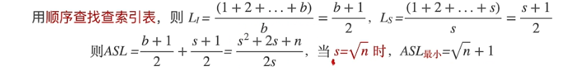
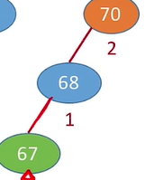
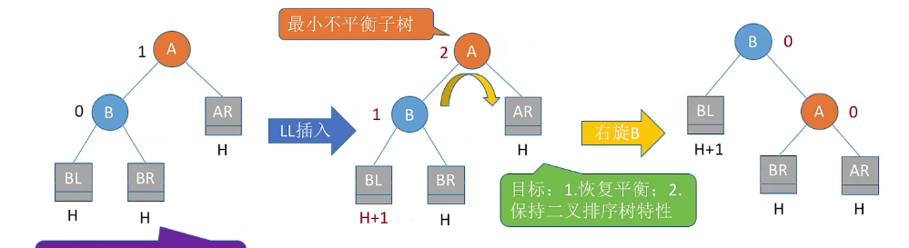
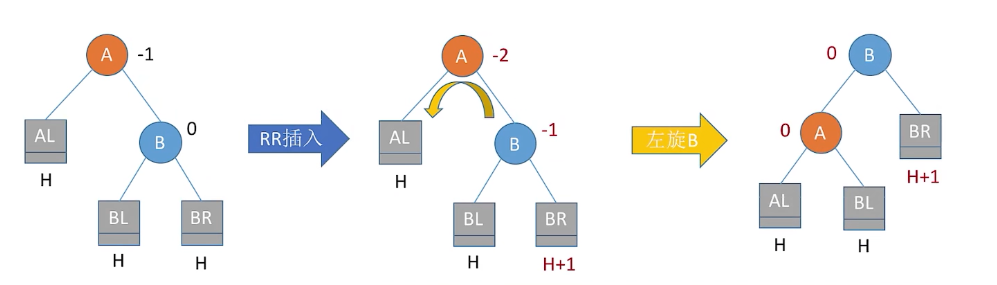
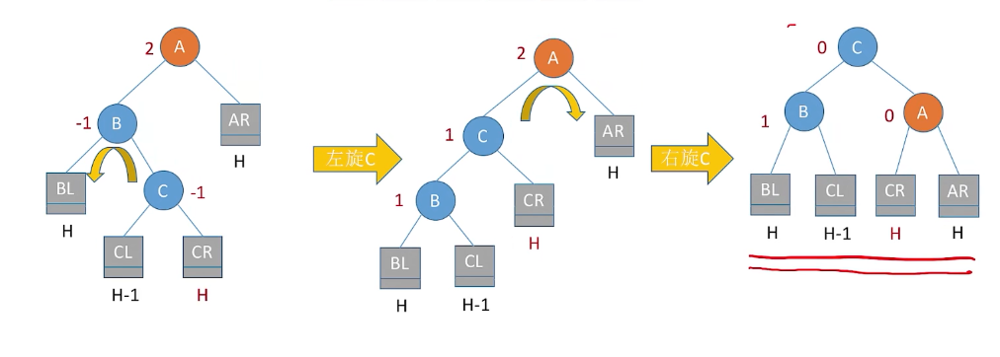
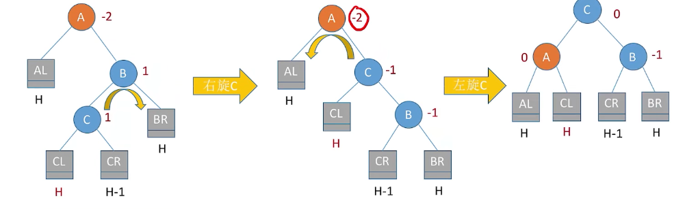
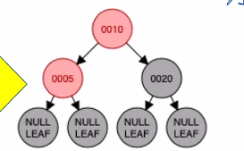
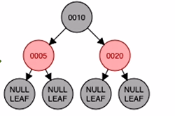
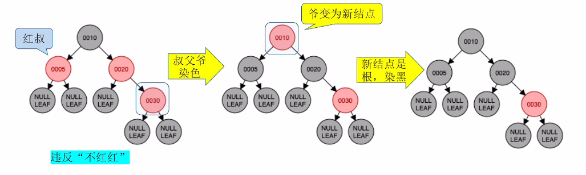

# 7. 查找
## 7.1 查找的基本概念

### 7.1.1 查找算法的评价指标

ASL平均查找长度 —— 所有查找过程中进行关键字的比较次数的平均值

分为两种，**查找成功ASL**和**查找失败ASL**

>ASL的数量级反应了查找算法时间复杂度


查找成功ASL按照


## 7.2 顺序查找和折半查找

### 7.2.1 顺序查找
又称为线性查找，常用于线性表（链式和顺序）
从头到尾挨个对比
#### 7.2.1.1顺序查找的实现（哨兵）
```c
//实际数据从下标1开始存储，0号位置存储待查找元素
typedef struct{//查找表的数据结构（顺序表）
	ElemType *elem; //动态数组基地址
	int TableLen;//表的长度
}SSTable;

//顺序查找
int Search_Seq(SSTable ST,ElemType key){
	ST.elem[0]=key;//“哨兵”
	int i;
	for(i=ST.Tablen;ST.elem[i]!=key;--i);//从后向前找
	return i;//查找成功，则返回元素下标;查找失败，则返回0
}
```
#### 7.2.1.2  顺序查找的优化
1. 对有序表

    

    一个成功节点的查找长度=自身所在层数

    一个失败节点的查找长度=其父节点所在层数

    可以**优化查找失败时的ASL长度**，（不要遍历全部元素）

    

2. 查找概率不相等

    把表的顺序按照查找概率降序排列，可以**优化查找成功时的ASL长度**，但是查找失败时的ASL还是一样。
### 7.2.2 折半查找
**仅适用于有序的顺序表**，（链式不能用）

#### 7.2.2.1 折半查找的代码实现
```c
typedef struct{		//查找表的数据结构
	ELemType *elem;	//动态数组基址
	int TableLen;	//表的长度
}SSTable;

int Binary_Search(SSTable L,ElemType key){
	int low=0;
	int high=L.Tablen-1;
	int mid;
	while(low<=high){		//找不到的情况下会使得low>high,此时查询已经失败
		mid=(low+high)/2;	//向下取整，取中间
		if(L.elem[mid]==key)
			return mid;		//查找成功则返回所在位置
		else if(L.elem[mid]>key)
			high=mid-1;		//从前半部分继续查找
		else
			low=mid+1;		//从后半部分继续查找
	}
	return -1;				//查找失败，返回-1
}
```
#### 7.2.2.2 查找效率分析


> 绿色为查找成功的节点，紫色为查找失败的节点
> 
> 层高反应了对应节点的查找次数

查找成功ASL=查找成功各个元素的平均层高

查找失败ASL=查找失败元素的父节点的平均层高
#### 7.2.2.3 折半查找判定树的构造
当表中元素为奇数时，左子树和右子树中元素个数相等
当表中元素为偶数时，左子树中元素个数比右子树少一个(计算机除法运算自动向下取整)

>折半查找树的判定树，一定是平衡二叉树
>元素为n的表的折半查找判定树高为h= 向上取整$log_{2}(n+1) $

### 7.2.3 分块查找
特点：**块内无序，块间有序**


分块查找又称索引顺序查找，算法过程如下：
 1. 在索引表中确定待查记录所属的分块（可顺序、可折半）
 2. 在块内顺序查找

#### 7.2.3.1 在索引中使用折半查找
> 在折半查找索引时，发生$ high<low $时，不是代表查找失败，而是代表查找目标可能在low所指的分块中。 

#### 7.2.3.2 分块查找的查找效率分析


假设长度为n的查找表被均匀地分为b块，每块s个元素

设索引查找和块内茶渣的平均查找长度分别为$L_{I},L_{S}$，则分块查找的平均查找长度为

$ASL=L_{I}+L_{S}$

1. 顺序查找索引表时

    

    也就是说，10000个元素的表，分成100块，每块100个时，查找速率最快

2. 折半查找索引表时

    > 不重要


## 7.3 树型查找
### 7.3.1  二叉排序树
#### 7.3.1.1二叉排序树的定义
二叉排序树，又称为二叉查找树（BST，Binary Search Tree）一棵二叉树或者空二叉树，或者是具有如下性质的二叉树：
1. $ 左子树节点的值<根结点值<右子树结点值 $
2. 左子树和右子树又各是一棵二叉排序树

#### 7.3.1.2二叉排序树的查找
若树非空，目标值与根结点的值比较：
若相等，则查找成功；
若小于根结点，则在左子树上查找，否则在右子树上查找。
查找成功，返回节点指针；查找失败，返回NULL 
```c
BTSNode *BST_search(BSTree T,int key){
	while(T!=NULL&&key!=T->key){
		if(kety<T->key)
			T=T->lchild;
		else
			T=T->rchild;
	}
	return T;
}
```
#### 7.3.1.3二叉排序树的插入
若原二叉排序树为空，则直接插入节点；否则，若关键字k小于根结点值，则插入到左子树，若关键字k大于根结点值，则插入到右子树 
```c
int BST_Insert(BSTree &T,int k){
	if(T=NULL){			//原树为空，新插入的节点为根结点
		T=(BSTree)malloc(sizeof(BSTnode));
		T->key;
		T->lchild=T->rchild=NULL;
		return 1;		//返回1，插入成功
	}
	else if(k==T->key)	//树中存在相同关键字的节点，插入失败
		return 0;
	else if(K<T->key)	//插入到T的左子树
		return BST_Insert(T->lchild,k);
	else 				//插入到T的右子树
		return BST_Insert(T->rchild,k);
}
```
#### 7.3.1.4二叉排序树的删除
先搜索找到目标结点，假设要删除节点z：
1. 情况一：若被删除节点z是叶子节点，则直接删除，不会破坏二叉树的性质。

2. 情况二：若节点z只有一颗左子树或右子树，则让z的子树成为z父节点的子树，代替z的位置。

3. 若节点z有左、右两颗子树，则令z的直接后继（或直接前驱）替代z，然后从二叉排序树中删驱这个直接后继（或直接前驱），这样就转换成了第一种或者第二种情况。
    第一种方式，直接后继来替代被删除节点：
    
    
    找到要删除节点在中序遍历中的后继节点，然后用后继节点来替代被删除节点的位置，然后删除从树中删除后继节点的位置，由于后继节点必然是叶子节点，或只有一棵子树的节点（后继节点必然是右子树最左下的一个节点），所以按照情况1、2来处理即可。

第二种方式，直接前驱来替代被删除节点：


找到要删除节点在中序遍历中的前驱节点，然后用前驱节点来替代被删除节点的位置，然后删除从树中删除前驱节点的位置，由于前驱节点必然是叶子节点，或只有一棵子树的节点（前驱节点必然是左子树最右下的一个节点），所以按照情况1、2来处理即可。

#### 7.3.1.5查找效率分析
##### 查找长度

###### 成功查找长度：

查找成功的平均查找长度ASL(Average Search Length)


$ ASL=(1*1+2*2+3*4+4*1)/8=2.625 $


$ASL=(1*1+2*2+3*1+4*1+5*1+6*1+7*1)/8=3.75 $

可以看出查找效率和树的高度有关，

**最好的情况**：n个结点的二叉树最小高度为$ \lfloor log_{2}n \rfloor+1$ 故此时平均查找长度为O($log_{2}n$) 

**最坏的情况**：每个节点只有一个分支，树高h=节点数n，平均查找长度=O(n)。

###### 失败查找长度
如果查找失败，指针最后肯定会停留在这些地方：


 


### 7.3.2 平衡二叉树

#### 7.3.2.1平衡二叉树的定义
1. **平衡二叉树**（Balanced Binary Tree），简称平衡树(AVL树(以发明者名字命名))--树上任意结点的左子树和右子树的高度之差不超过1。

2. **结点的平衡因子**，结点的平衡因子=左子树树高-右子树树高
>显然平衡二叉树的结点的平衡因子只可能是0 ，-1， 1 三个值

3. **最小不平衡树**，往一个平衡二叉树（本文中均指“平衡二叉排序树”）插入新的叶子节点，从插入点由下往上，依次遍历插入点的各个祖先节点，记录**第一个**遍历到的平衡因子不为0，-1，1（即不平衡）的祖先节点，以该节点为根节点的子树就是这棵树的最小不平衡子树。


如图在插入67这个节点后，

 

以67开始，往上寻找他的祖先结点，找到70这个节点的不平衡因子为2，于是以70为根节点的子树就是原树的最小不平衡树。

最小不平衡二叉树的**4种类型**：
1. LL，在A的左孩子的左子树中插入导致的不平衡
一次右旋搞定
2. RR，在A的右孩子的右子树中插入导致的不平衡
一次左旋搞定 
3. LR，在A的左孩子的右子树中插入导致的不平衡
先左旋，再右旋
4. RL，在A的右孩子的左子树中插入导致的不平衡
先右旋，再左旋
#### 7.3.2.2平衡二叉树的插入
主要讨论平衡二叉树在插入操作后如何保持平衡， 根据插入后产生的四种最小不平衡二叉树，可以分为4种类型：

根为A的最小不平衡二叉树的**4种类型**：

1. LL，在A的**左孩子**B的**左子树**中插入导致的不平衡
    一次**右旋**搞定
    
    >将A的左孩子B向右上旋转代替A成为(最小不平衡树的)根结点，将A结点向右下旋转成为B的右子树的根结点，而B的原右子树则作为A结点的左子树
    >
    >**B的右孩子变成A的左孩子，然后A变成B的右孩子**
    
    >
    
    
    
2. RR，在A的**右孩子**B的**右子树**中插入导致的不平衡
    一次**左旋**搞定 
    
    >将A的右孩子B向左上旋转代替A成为根结点，将A结点向左下旋转成为B的左子树的根结点，而B的原左子树则作为A结点的右子树
    >
    >**B的右孩子变成A的左孩子，然后A变成B的右孩子**
    
    
    
3. LR，在A的**左孩子**B的**右子树**中插入导致的不平衡
    先左旋，再右旋
    
    >  先将A结点的左孩子B的右子树的根结点C向左上旋转提升到B节点的位置，然后再把该C节点向右上旋转提升到A结点的位置。
    >
    >**先把C的左子树变成B的右子树，再让B变成C的左子树（完成左旋），**
    >**然后把C的右子树变成A的左子树，再把A变成C的左子树（完成右旋）**
    
    
    
4. RL，在A的**右孩子**B的**左子树**中插入导致的不平衡
    先右旋，再左旋
    
	>先将A结点的右孩子B的左子树的根结点C向右上旋转，提升到B结点的位置，然后把该C结点向左上旋转提升到A结点的位置。
	>
	>**先把C的右子树变成B左子树，然后让B变成C的左子树（完成右旋），**
	>
	>**然后把C的左子树变成A的右子树，再把A变成C的右子树（完成左旋）**
	
	

**重要**:只有左孩子才能右旋（本质是右孩子把父节点变成左孩子），只有右孩子才能左旋（本质是左孩子把父节点变右孩子）

练习：王道P76 22:41

#### 7.3.2.3平衡二叉树的删除
若删除节点导致不平衡，则需要调整。

##### 二叉树的删除操作步骤
1. 删除节点（方法同"二叉排序树"，移动中序遍历的直接前序或直接后序替代删除产生的空位，然后调整移动产生的空位）（用删除节点的左子树的最大叶子节点，或右子树的最小叶子结点替代） 
2. 从该结点开始往上寻找最小不平衡二叉树，找不到就结束
3. 找最小不平衡子树下，" 个头 "（树高）最高的儿子，孙子
4. 根据孙子的位置，调节平衡（LL/RR/LR/RL）
    - 孙子在LL：儿子右单旋
    - 孙子在RR：儿子左单旋
    - 孙子在LR：孙子先左旋，再右旋
    - 孙子在RL：孙子先右旋，再左旋
5. 如果不平衡向上传导，继续 2 。

### 7.3.4 红黑树
平衡二叉树在插入删除时，为了保证树的平衡状态，需要频繁调整树的形态。如：插入导致不平衡，删除导致不平衡，要先计算平衡因子，找到最小不平衡子树，再进行LL/RR/LR/RL调整。

红黑树在插入删除时，很多时候不会破坏“红黑”特性，无需平凡调整树的形态。即便需要调整，也可以在常数级时间内完成。


**如果需要频繁插入删除，选择红黑树；如果需要平凡查找，很少插入删除，选择平衡二叉树** 

#### 7.3.4.1 红黑树的定义

红黑树也是二叉排序树，满足$左子树节点值 \le 根结点值 \le右子树结点值$

1. 每个节点或是红色，或是黑色
2. 根结点是黑色的
3. 叶结点（外部结点、NULL、失败结点）均是黑色的
4. 不存在两个相邻的红节点（即红节点的父节点和孩子结点均是黑色）
5. 对每个结点，从该节点到任一叶结点的简单路径上，所含黑结点的数目相同

**左根右，根叶黑，不连红，黑高同**

**黑高**：从某节点触发，到达任一空叶结点的路径上黑结点总数（路上遇到的黑结点+黑色叶结点）


#### 7.3.4.2 红黑树的性质
性质1：从根结点到叶结点的最长路径不大于最短路径的2倍

性质2：有n个内部节点的红黑树高度$ h \le 2*log_{2}(n+1)$ 
>红黑树查找操作时间复杂度=$O(log_{2}n)$

#### 7.3.4.3 红黑树的查找

 红黑树的查找和二叉排序树一样，

#### 7.3.4.4 红黑树的插入

> 插入只会破坏不能连红的性质。（插入新结点默认涂红，不会破坏黑路同）。


例1：LL连红，黑叔：


进行右单旋，**父换爷+染色**

> 右单旋是方向，父换爷和染色是具体方法

​	1.父换爷



2. 染色（红变黑，黑变红）

    

例2：RR连红，红叔：  

 

> 爷变为新结点的意思是，对爷节点重新检查是否符合红黑树的定义（可能破坏**不红红，根叶黑(根可能变成红色)**）

 

#### 7.3.4.5 红黑树的删除

**重要考点**：

1. 红黑树删除操作的时间复杂度 = $ O(log_{2}n) $ 
1. 在红黑树中删除节点的处理方式和“二叉排序树的删除”一样（删除后用中序遍历的前驱/后驱代替）
1. 按2 删除节点后，可能破坏“红黑树特性”，此时需要调整节点颜色，位置，使其再次满足“红黑树特性”。


### 7.3.5 B树 


  
