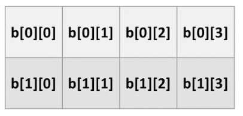
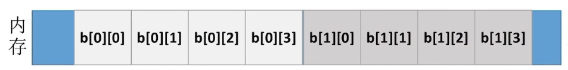
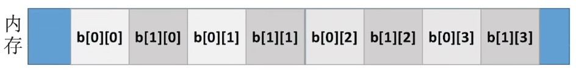
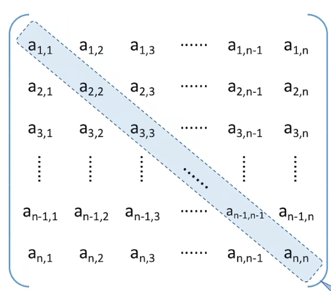
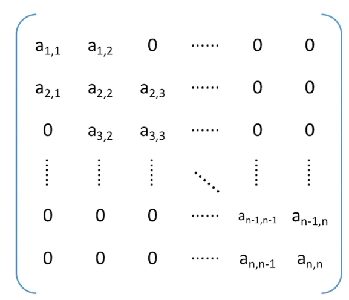
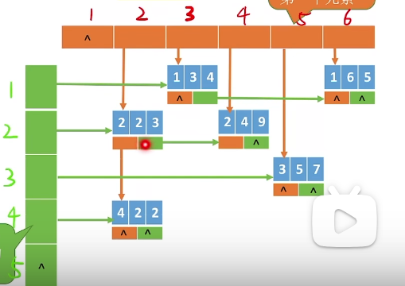

# 4.数组和特殊矩阵
## 4.1数组的存储结构
对于二维矩阵，数组有两种存储方法：


### 4.1.1 行优先

对于采用**行优先**存储的**M行N列**的矩阵，B\[ i \]\[ j \]的存储位置为:

```c
ElemType M[i][j];
M[i][j] == M(LOC) + (i*N+j)*sizeof(ElemType);//B(LOC)为数组B的起始地址
//i*N是前i行的元素总数，j是第i+1行的元素个数
```

### 4.1.2 列优先

对于采用**列优先**存储的**M行N列**的矩阵，B\[ i \]\[ j \]的存储位置为:

```c
ElemType M[i][j];
M[i][j] == M(LOC) + (j*M+i)*sizeof(ElemType);//B(LOC)为数组B的起始地址
//j*M是前j列的元素总数，i是第j+1行的元素个数
```

## 4.2特殊矩阵的压缩算法
### 4.2.1对称矩阵的压缩存储

对称矩阵一定是方阵。
策略：只存储主对角线 + 下三角区

按**行优先**或者**列优先**原则将各元素存入一维数组中。

#### 压缩后的大小
>设矩阵的规模为n，则一维数组的大小为：
>```c
>(1+n)*n/2   //等差数列求和公式Sn=n(a1+an)/2=n*a1+n*(n-1)d/2
>```
>所以一维矩阵的下标范围为：
>```c
>[0,((1+n)*n / 2)-1]
>```

#### 矩阵下标--->一维数组下标

矩阵M`M[i][j]`的**`i和j的取值范围为[1,n]`**。
**注意**：*矩阵的下标一般从1开始a1,1 a1,2 a1,3等，但数组的下标一般从0开始。*

>一、按照**行优先**的原则:
>
>1. 当 `i>=j`，即`M[i][j]`为下三角及主对角线中的元素时：
>```c
>//前i-1行的元素总数为(1+2+3+4+5····+i-1),i-1是第i-1行的元素个数
>M[i][j]=CM[i*(i-1)/2+j-1]//i*(i-1)/2是矩阵下三角前i-1行元素个数的和，j是第i行元素个数，从0开始计数所有要-1
>```
>
>2. 当`j<i`，即`M[i][j]`为上三角中的元素时：
>```c
>M[i][j]=M[j][i]=CM[j*(j+1)/2+j]//因为是对称矩阵，所以M[i][j]=M[j][i],而M[j][i](j>i)是下三角,可以用套用i>=j时的公式,上底加下底乘高除二
>```
>
>二、按照**列优先**的原则：
>1. 当`i>=j`，既`M[i][j]`为下三角及主对角线中的元素时：
>```c
>/*前j-1列的元素总数为：
>n+(n-1)+(n-2)+(n-3)+(n-4)+····+( n-((j-1)-1))= 
>*/
>M[i][j]=CM[j*(n+n-((j-1)-1))/2 + (i-j)+1]=CM[j*(2n-j+2)/2 + (i-j)+1]//j(2n-j+2))/2是前j-1列元素的和，(i-j)是在第j列中目标元素前的元素个数，然后+1就是目标元素
>```
>2. 当`i<j`，即`M[i][j]`为上三角中的元素时：
>```c
>M[i][j]=M[j][i]=CM[i*(2n-i+2)/2 + (j-i)+1]//因为是对称矩阵，所以M[i][j]=M[j][i],而M[j][i](j>i)是下三角,可以用套用i>=j时的公式求得
>```
>

### 4.2.2 三角矩阵的压缩存储

对称矩阵的压缩算法.assets/image-20230920194642550.png)

分为*下三角矩阵*和*上三角矩阵*
压缩存储策略：对角线+上三角或下三角+常数
*和对称矩阵基本一致*
#### 压缩后的大小
>设矩阵规模为n:
>```c
>(1+n)*n/2+1   //等差数列求和公式Sn=n(a1+an)/2=n*a1+n*(n-1)d/2
>```

#### 矩阵下标--->一维数组下标
以下拿下三角矩阵的存储举例:
>一、按照**行优先**原则：
>1. 当`i>=j`，即`M[i][j]`为下三角及主对角线中的元素时：
>```c
>M[i][j]=CM[(i-1)*i/2+j - 1]//从0开始计数所以要-1
>```
>2. 当`i<j`，即`M[i][j]`为上三角中的元素时：
>```c
>//设矩阵的大小为n
>M[i][j]=CM[n*(n+1)/2]//在一维数组的末尾存储填充上三角的常数
>```
>二、按照**列优先**的原则：
>1. 当`i>=j`，既`M[i][j]`为下三角及主对角线中的元素时：
>```c
>/*前j-1列的元素总数为：
>n+(n-1)+(n-2)+(n-3)+(n-4)+····+((n-(j-1))-1)= 
>*/
>M[i][j]=CM[j*(n+n-((j-1)-1))/2 + (i-j)+1]=CM[j*(2n-j+2)/2 + (i-j)+1]//前j-1列元素的和加第j列中目标元素前的元素个数，然后+1就是目标元素
>```
>2. 当`i<j`，即`M[i][j]`为上三角中的元素时：
>```c
>M[i][j]=CM[n*(n+1)/2]//读取一维数组末尾即可
>```
>

### 4.2.3 三对角矩阵（带状矩阵）的压缩存储



对于n阶矩阵A中的任意一个元素`a[i,j]`,当 `|i-j|>1`时，有`a[i][j]=0(1<i,j<n)`,称为三对角矩阵（带状矩阵）。

压缩存储策略:按行优先或者列优先，只存储带状部分
#### 压缩后的大小
>设矩阵的规模为n：
>由图像易得压缩后一维矩阵大小为`3n-2`
>一维矩阵的下标范围为`[0,3n-3]`

#### 矩阵下标--->一维数组下标
>一、按照**行优先**原则：
>1. 当`a[i][j]`满足(`|i-j|<=1`)时：
>```C
>/*
>1.前i-1行有(i-1)*3-1个元素。//每行有三个得(i-1)*3，但第一行缺一个所以-1
>2.a[i][j]是第i行的第2+j-i个元素。//因为a[i][i]一直在对角线上，且为第二个元素，同行的剩余两个元素不是在他左边就是在他右边，所以可以通过j-i来判断位置（j>i，j-i=1在右边;j<i,j-1在左边）
>则a[i][j]是第2i+j-2个元素
>*/
>//由以上可得：
>M[i][j]=CM[2i+j-2 -1]//下标从0开始，故再-1
>```

#### 一维数组下标--->矩阵下标
>一、按照**行优先**原则：
>`CM[k]`是第`k+1`个元素
>前`i-1`行一共有`3(i-1)-1`个元素
>前`i`行一共有`3i-1`个元素
>显然有`3(i-1)-1`<`k+1`<`3i-1`

### 4.2.4 稀疏矩阵的压缩存储

非零元素远远少于矩阵元素的个数
压缩存储策略：

1. 三元组存储

>把有数值的位置进行记录
>		顺序存储  行---列---值

2.十字链表法
>链式存储 把每个元素用一个节点存储，每个节点包含：
>		*行，列，值，行指针域，列指针域*
>		再建立两个指针数组，其中的指针指向每行或每列的第一个节点，然后该节点的指针继续指向同行或同列的下一个节点


