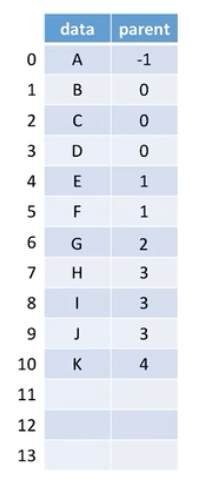
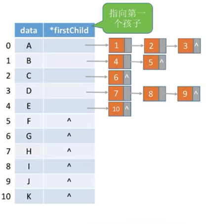
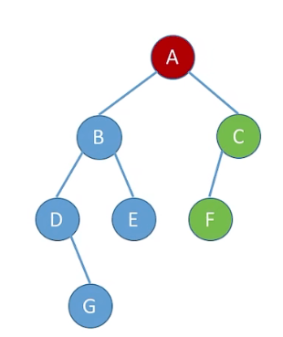
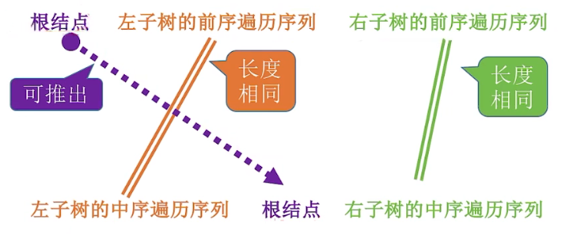
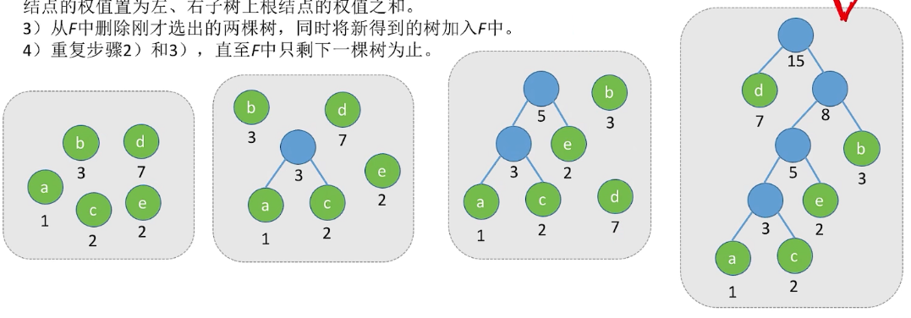

# 5.树与二叉树
## 5.1树的基本概念
### 5.1.1树的定义
树是n(n>=0)个结点的有限集。当n=0时，称为空树。在任意一棵非空树中应满足：
- 只有一个称为*根* 的节点。

- n>1时，其余结点可分为m(m>0)个互不相交的有限集T1,T2,....,Tm,其中每个集合本身也是一棵树，并且称为根的子树。

**树是一种 *递归定义*  的数据结构**，作为一种逻辑结构，同时也是一种分层结构：

- 树的根结点没有前驱，除根结点外的所有节点都只有一个前驱。

- 树中所有的节点都可以有零个或者多个后继

### 5.1.2树的性质
树具有如下最**基本的性质**：
1. 树中的结点数等于所有结点度数之和加1。
2. 度为`m`的树中第`i`层上至多有$\Large m^{i-1}$ 个结点(i>=1)。
3. 高度为`h`的`m`叉树至多有$\frac{\Large m^{h}-1}{\Large m-1}$ 个结点。(最少有h+(m-1)个结点)
4. 具有n个结点的m叉树的最小高度为$\left \lceil\large\log_{m}{(n(m-1)+1)} \right \rceil$ （向上取整）。

### 5.1.3树的存储
1. 双亲表示法(顺序存储)

  

  每个节点保存指向双亲的“指针”。(保存双亲的下标)
```c
#define MAX_TREE_SIZE
typedef struct{						//树的节点定义
    elementtype data;				//数据元素
    int parent;						//双亲的位置域，每个节点存储他双亲的下标
}PTNode;
typedef struct{						//树的类型定义
    PTNode Nodes[MAX_TREE_SIZE]		//双亲表示
    int n;							//结点数
}PTree;
```
优点是查找双亲很方便，缺点是查找孩子结点只能从头遍历。
2. 孩子表示法（顺序+链式存储）
    顺序存储各个节点，每个节点中保存孩子链表头指针。
    
```c
struct CTNode{
    int child;
    struct CTNode *next;
};
typedef struct{
    elementype data;
    struct CTNode* firstChild;
}CTBox;
typedef struct{
    CTBox nodes[MAX_TREE_SiZE];
    int n,r;
}CTree;
```
3. 孩子兄弟表示法（链式存储）********
树和二叉树的转化
```c
typedef struct CSNode{
    elementtype data;
    struct CSNode *firstchild,*nextsibling;
}CSNode,*CSTree;
```
优点是可以用二叉树操作来处理树   
### 5.1.4 树和森林的遍历
#### 5.1.4.1树的遍历
1. 先根遍历（树的深度优先遍历）
逻辑与二叉树的先序遍历一样，如果把树转化为二叉树，则树的先根遍历和二叉树的先根遍历一致。
2. 后根遍历（树的深度优先遍历）
逻辑与二叉树的后序遍历一样，如果把树转化为二叉树，则**树的后根遍历与二叉树的中序遍历一致。**
3. 层序遍历（树的广度优先遍历）
与二叉树的层序遍历一样。
#### 5.1.4.2森林的遍历
1. 先序遍历
若森林为非空，则按如下规则进行遍历：
  - 访问森林中第一棵树的根结点。
  - 先序遍历第一棵树中根结点的子树森林。
  - 先序遍历除去第一棵树之后剩余的树构成的森林。
**（对各个树进行先序遍历，然后按顺序排成一列即可）**
2. 中序遍历
若森林为非空，则按如下规则进行遍历：
  - 中序遍历森林中第一棵树的根结点的子树森林。
  - 访问第一棵树的根结点。
  - 中序遍历除去第一棵树之后剩余的树构成的森林。
（效果等同于依次对各个树进行**后根遍历**）

总结：
```
树     |森林   |二叉树
先根遍历|先序遍历|先序遍历
后根遍历|中序遍历|中序遍历
```

## 5.2二叉树的概念
### 5.2.1二叉树的定义及其主要特性
#### 5.2.1.1 二叉树的定义
二叉树是一种特殊的树形结构，其特点是每个结点至多只有两颗子树(即二叉树中不存在的度大于2的结点)，并且二叉树的子树有左右之分，不能任意颠倒。
其定义与树类似：

- 二叉树可以为空。
- 二叉树由一个根和两个互不相交的左子树和右子树组成。
二叉树是**有序树**，就算树中结点只有一颗子树也要区分它是左子树还是右子树。
#### 二叉树与度为2的树的区别：
1. **度为2的树至少要有3个结点，而二叉树可以为空**。
2. 度为2的有序树的孩子的左右次序是相对于另一个孩子而言的，若某个结点只有一个孩子，则这个孩子就无须区分左右次序；而**二叉树无论其孩子数是否为2，均需确定其左右次序**，即二叉树的节点次序不是相对于另一个结点而言的，而是确定的。
#### 特殊的二叉树
1. 满二叉树
一颗高度为h,且含有$\large 2^{h}-1$ 个结点的二叉树称为*满二叉树* ，即树中的每层都含有最多的结点。满二叉树的叶子结点都在二叉树的最下一层，并且除叶子结点外的每个节点的度都为2。
>满二叉树从上到下，从左到右编号。
>对于编号为 i 的结点：
>
>- 其双亲为$\left \lfloor i/2\right \rfloor $ (若有的话)
>- 左孩子为 2i 
>- 右孩子为 2i+1

2. 完全二叉树
    高度为`h`,有`n`个结点的二叉树，当且仅当其每个结点都与高度为`h`的满二叉树中编号为`1~n` 的节点一 一对应时，称为完全二叉树。
    
    其特点如下：
>1. 若$\large i\le\left \lfloor n/2 \right \rfloor $ ，则结点`i`为分支节点，否则为叶子节点。
>2. 叶子结点只可能出现在层次最大的两层上出现。对于最大层次中的叶结点，都依次排列在该层最左边的位置上。
>3. 若有度为1的节点，则只有一个，且该结点只有左孩子而无右孩子（**重要特征**）。
>4. 若出现编号为`i`的结点只有左孩子（度为1），则`i`之后的节点均为叶子结点。
>5. 若`n`为奇数，则每个分支结点都有左孩子和右孩子；若`n`为偶数，则编号最大的分支结点（编号为`2/n`）只有左孩子，没有右孩子，其余分支结点左，右孩子都有。

3. 二叉排序树

    左子树上所有结点的关键字均小于根结点的关键字；右子树上的所有结点的关键字均大于根结点的关键字；左子树和右子树又各是一颗二叉排序树。

4. 平衡二叉树

    树上任意一个结点的左子树和右子树的深度之差不超过1。

#### 5.2.1.2二叉树的性质
1. 非空二叉树上的叶子节点数等于度为2的节点数+1，即$n_{0}=n_{1}+1$ 。
> 总节点数：
> $n=n_{0}+n_{1}+n_{2}$ 
> 又因为总结点数等于所有结点度数之和+1  （树的性质）
> $n=n_{1}+2n_{2}+1$ 
> 两式子去等化简得到：$n_{0}=n_{1}+1$ （叶子节点比度为1的节点多1个）

2. 非空二叉树上第`k`层上至多有$\large 2^{k-1}$ 个结点 （k>=1）。
> 可以证得其为公比为2的等比数列

3. 高度为`h`的二叉树至多有$\large 2^{h}-1$ 个结点 （h>=1）。
> 等比数列求和得出。

4. 对完全二叉树编号：

> 1. 当`i`>1时，结点`i`的双亲的编号为$\large\left \lfloor i/2\right \rfloor$ ，即当`i`为偶数时，其双亲节点为`i/2`，它是左孩子；其为奇数时，其双亲结点为`(i-1)/2`，其为右边孩子。
> 2. 当`2i <= n`时，结点`i`的左孩子编号为`2i`，否则无左孩子。
> 3. 当`2i+1 <= n`时，结点`i`的右孩子编号为`2i+1`, 否则无右孩子。
> 4. 结点`i`所在层次（深度）为$\large\left \lfloor log_{2}i \right \rfloor+1$ 。

5. 具有n个（n>0）结点的完全二叉树的高度为$\large\left \lceil log_{2}(n+1) \right \rceil$或$\large\left \lfloor log_{2}n \right\rfloor+1 $。

### 5.2.2二叉树的存储结构  
1. 顺序存储结构
满二叉树和完全二叉树适合用顺序存储，因为可以让下标反映结点之间的逻辑关系，对于一般的二叉树，只能添加一些并不存在的空结点来让其节点与完全二叉树上的节点对照，再存储到一维数组中去。
```c
typedef int ElementType;//定义树的元素类型
typedef struct treeNode{
    ElementType data;
    int isEmpty; 
}treeNode;
int main(){
    treeNode T[100+1];//T[0]不用,对齐下标，T[1]是根节点
    for(int i=1;i<=MAXSIZE;i++){
        T[i].isEmpty=TRUE;
    }
}
```
2. 链式存储结构
由于顺序存储的空间利用率较低，一般都用链式存储来存储二叉树。
```c
typedef int ElementType;//定义树的元素类型
typedef struct treeNode{
    ElementType data;
    treeNode* leftChild;
    treeNode* rightChild;
    //treeNode* parent; //如果需要知道父节点的话，可以加上这一行
}treeNode,*Tree;
```
**n个结点的二叉链表共有n+1个空链域**

## 5.3二叉树的遍历和线索二叉树
### 5.3.1 二叉树的遍历



1. 先序遍历

    按照  根  左  右  的顺序来遍历树，

    按照分支节点逐层展开法，上图应该表示为：

```
    根    左                     右                       A    B                      C
    根  （根  左       右）  	  （根  左       右）	    A    BD E                   CF
    根  （根（根左右）（根左右））（根（根左右）（根左右））  A	BDGE                   CF
    最终结果为ABDGECF
```

2. 中序遍历
    按照  左  根  右  的顺序来遍历树,
    按照分支节点逐层展开法，上图应该表示为：
```
               左           根           右                        B           A           C               
        （左   根    右）    根   （左    根   右）                D BE         A           CF
    （（左根右）根（左根右））根（（左根右）根（左根右））            DGBE         A           CF 
    最终结果为DGBEACF
```

3. 后序遍历
    按照  左  根  右  的顺序来遍历树,
    按照分支节点逐层展开法，上图应该表示为：
```
                        左                     右  根                        B                     C  A      
          （左       右  根）     （左       右  根）根				    DEB                    FC  A
    （（左右根）（左右根）根）（（左右根）（左右根）根）根				      GDEB                    FC  A
    最终结果为GDEBFCA
```

4. 层序遍历
    层序遍历非常简单，就是从左到右，从上到下依次遍历

### 5.3.2由遍历序列构建二叉树
**必须知道中序遍历和任意一种其他遍历才能还原出二叉树**，

例如已知前序遍历和中序遍历：



同理可得其他情况如何处理

### 5.3.3线索二叉树
普通的二叉链表存储仅能体现一种父子关系，不能直接得到节点在遍历中的前驱和后继。
线索二叉树是利用每个叶子节点的两个空指针来存储该叶子节点的前驱和后继，使得遍历二叉树可以像遍历链表一样方便。
线索二叉树的存储结构描述如下：
```c
typedef struct ThreadNode{
    ElementType data;	//数据元素
    struct ThreadNode *Lchild,*Rchild;   //左、右孩子指针
    //struct ThreadNode *parent;       //指向其父节点，需要时可加上这一行 
    int Ltag,Rtag;	//左、右线索标志
}ThreadNode,*ThreadTree;  
```
其中 Ltag 为 0 时，Lchild 指向左孩子；为 1 时，Lchild 指向前驱节点。
Rtag同理，为 0 时指向右孩子，为 1 时指向后继节点。

#### 5.3.3.1 二叉树的线索化

#### 5.3.3.2 线索化后寻找前驱后继
给出在线索二叉树的任意节点`p`，找到`p`的后继`next`与`pre`。
总结：
中序可以找前驱也可以找后继，先序找前驱需要借助父节点指针(或遍历)，后序找后继需要父节点指针(或遍历)。
##### 中序线索化
1. 中序线索化的后继
  - 当`p->Rtag==1`时，`next==p->Rchild`。
  - 当`p->Rtag==0`时，`p`结点的后继为其右子树的最左下角的节点。
```
左根   右			
左根(左根右)		  //可以看出根的右子树展开后，与根相邻的节点是根的右子树的左孩子
左根((左根右)根右)  //可以看出根的右子树展开后，与根相邻的节点是根的右子树的左孩子的左孩子
```
2. 中序线索化的前驱
  - 当`p->Ltag==1`时，`pre==p->Lchild`。
  - 当`p->Ltag==0`时，`p`结点的前驱为其左子树的最右下角的节点。
```
   左  根右			
(左根右)根右		  //可以看出根的左子树展开后，与根相邻的节点是根的左子树的右孩子
(左根(左根右))根右  //可以看出根的右子树展开后，与根相邻的节点是根的右子树的左孩子的左孩子
```
##### 先序线索化

1. 先序线索化的后继
    两种情况：
  - 若`p->Rtag==1`，则`next=p->Rchild`
  - 若`p->Rtag==0`又分为两种情况：
```      
1.若`p`有左孩子，则后继为左孩子
根左右
根(根左右)右     //可以看到有左孩子时，后继为左孩子
2.若`p`没有左孩子，则后继为右孩子
根右
根(根左右)		//可以看到没有左孩子时，后继为右孩子
```
2. 先序线索化的前驱
  - 若`p->Ltag==1`，则`pre=p->Lchild`
  - 若`p->Ltag==0`，则有四种情况：
``` 
(在线索二叉树中，只知道一个节点，若其是非叶子节点那么是无法找到其先序前驱节点的。因为它的前驱是它的父节点或其兄弟节点，而该节点只有指向其左右孩子的指针。)
↓↓↓↓↓↓↓↓↓↓故以下讨论的是存在指向父节点指针的线索二叉树(三叉树)↓↓↓↓↓↓↓↓↓↓
(因为P->Ltag==0,所以P一定有左孩子结点)
1.如果p是根结点，那么P没有前驱节点。
2.如果P节点是其父节点的左孩子节点，那么其父节点就是P点的前驱节点。
根左P右
3.如果P节点是其父节点的右孩子节点,又分为两种情况：
	1.P结点的父节点没有左孩子，那么P结点的前驱节点就是其父节点。
	根 右p
	根(根P左右)
	2.P结点的父节点有左孩子，那么P节点的前驱节点就是其左亲兄弟在先序遍历中最后一个被访问的节点。
	根 左               右P
	根(根 左     右     )右P
	根(根(根左右)(根左右))右P
```
##### 后续线索化
1. 后序线索化的后继
  - 若 `p->Rtag==1`，则`next=p->Rchild`
  - 若`p->Rtag==0`，则
```
(在线索二叉树中，只知道一个节点，若其是非叶子节点那么是无法找到其后序后继节点的。因为它的后继是它的父节点或其兄弟节点，而该节点只有指向其左右孩子的指针。)
↓↓↓↓↓↓↓↓↓↓故以下讨论的是存在指向父节点指针的线索二叉树(三叉树)↓↓↓↓↓↓↓↓↓↓
1. 如果P是其父节点的右孩子，那么P的后继为其父节点
2. 如果P是左孩子，且其父节点没有右孩子，那么P节点的父节点就是其后继节点
3. 如果P是左孩子，且其父节点有右孩子，那么其后继为其左亲兄弟节点在后序遍历中的最后一个被访问的节点。
```
2. 后序线索化的前驱
  - 若`P->Ltag==1`，则`pre=p->Lchild`
  - 若`P->Ltag==0`，(一定有左孩子)
```
1. 如果`p`结点有右孩子，那么其前驱节点为其右孩子
2. 如果`p`结点没有右孩子，那么其前驱节点为其左孩子
```
## 5.4 树与二叉树的应用
### 5.4.1 哈夫曼树与哈夫曼编码
#### 5.4.1.1 带权路径长度
- 结点的权：树中结点被赋予了一个代表某种意义的数值，这种数值称为节点的**权**。
- 结点的带权路径长度：从根节点到该节点经过的边数 X 该结点的权值 = 该结点的带权路径长度
- 树的带权路径长度：树中所有的**叶结点**的带权路径长度之和。(WPL,Weighted Path Lenegth)
#### 5.4.1.2 哈夫曼树的定义
在含有n个带权叶结点的二叉树中，其中**带权路径长度最小的二叉树**称为哈夫曼树，也称最优二叉树。
#### 5.4.1.3 哈夫曼树的构造



给定n个权值分别为w1,w2,....,wn的节点，构造哈夫曼树的算法描述如下:
1. 将这n个结点分别作为n棵仅含有一个结点的二叉树，构成森林F。
2. 构造一个新结点，从F中选取两颗根结点权值最小的树作为新结点的左、右子树，并且将新结点的权值置为左、右子树上根结点的权值之和。
3. 从F中删除刚才所选出的两颗树，同时将新得到的树加入F中。
3. 重复步骤2、3、，直到F中只剩下一棵树为止。

##### 哈夫曼树的特点
1. 每个初始节点最终都成为叶结点，且权值越小的结点到根结点的路径长度越大。
2. 哈夫曼树的结点总数为2n-1。
3. 哈夫曼树不存在度为1的结点。
4. 哈夫曼树并不唯一，但WPL必然相同且为最优解。
#### 5.4.1.4 哈夫曼编码
- ASCII是定长编码格式，哈夫曼编码是可变长度编码。
- 若没有一个编码是另一个编码的前缀，则称这样的编码是**前缀编码**
- 把字符出点的频度作为节点的权值，0代表左子树，1代表右子树，即可构造出哈夫曼树。
- 哈夫曼树不唯一，但WPL相同且为最优
### 5.4.2 并查集
并查集的本质是集合，但是是用树的结构来实现集合。
在同一个集合的两个元素，它们的祖先一定相同。
因为要不断地找双亲节点，所以树的双亲表示法比较适合用来实现并查集。
#### 并操作
```c
void Union(int S[],int Root1,int Root2){
//要求Root1与Root2是不同的集合
	if(Root1==Root2)
		return;
	S[Root2]=Root1;
}
```
#### 查操作
```c
int find(int S[],int x){
	While(S[x]>=0)
		X=S[x];
	return x;		//返回根的值
//最坏时间复杂度为：O(n)
}
```
#### 5.4.2并操作的优化
树的深度越高，查操作的时间复杂度就越大，素以可以在合并的时候，尽可能的让树不长高。
思路：我们可以用根节点的''指针''的绝对值来表示根的深度，合并的时候让深度小的树成为深度大的树的子树。
```c
void Union(int S[],int Root1,int Root2){
	if(Root1==Root2)	  //保证两个根不相同
		return;
	if(S[Root2]>S[Root1])//此处是负数，实际是Root1>=Root2,即如果Root1的深度大于Root2
		S[Root2]=Root1;   //直接让小树合并到大树，深度不变
	if(S[Root2]==S[Root1])//如果两棵树的大小相同，那么合并后树的深度会发生变化
		S[Root2]=Root1;   //也可以Root1合并到Root2上，然后Root2深度+1
		Root1-=1;         //让根结点的指针的绝对值+1表示深度+1
	}else{                //如果Root1小于等于Root2
		S[Root1]=Root2;   //
	}
}
```
优化前find的最坏情况是在一列度为1的树的末端开始查，最坏时间复杂度为O(N)；优化过后树的深度最大为$\left \lceil log_{2}{N}\right\rceil+1$,最坏的时间复杂度也变为O($log_{2}{N}$) ，其中N为节点个数。


