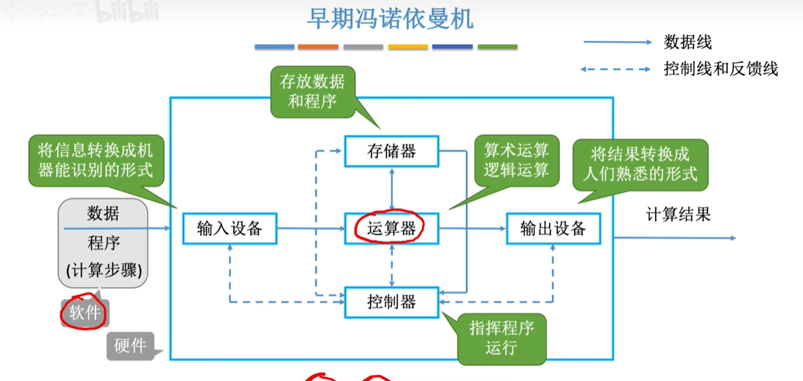
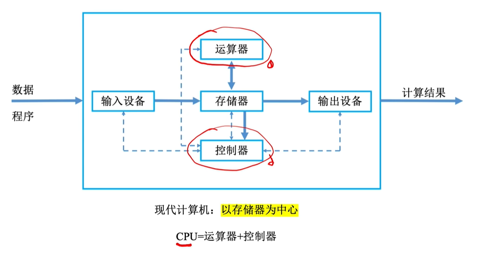
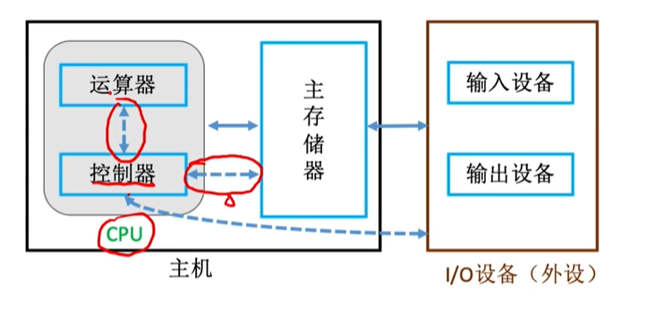
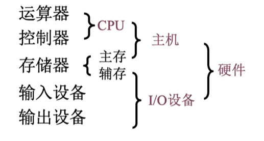
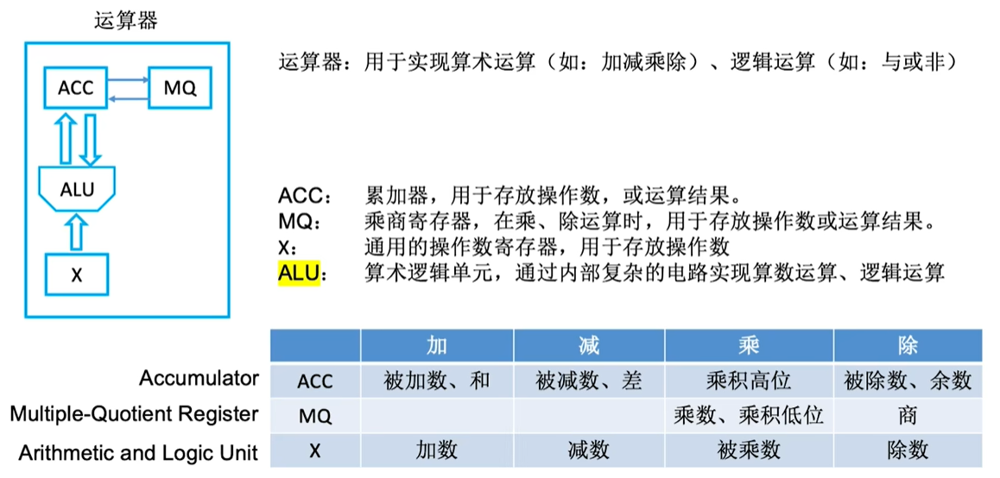
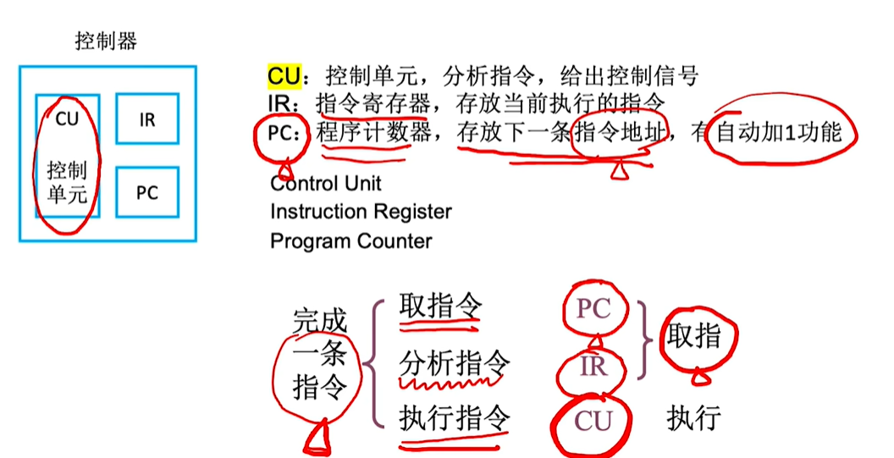
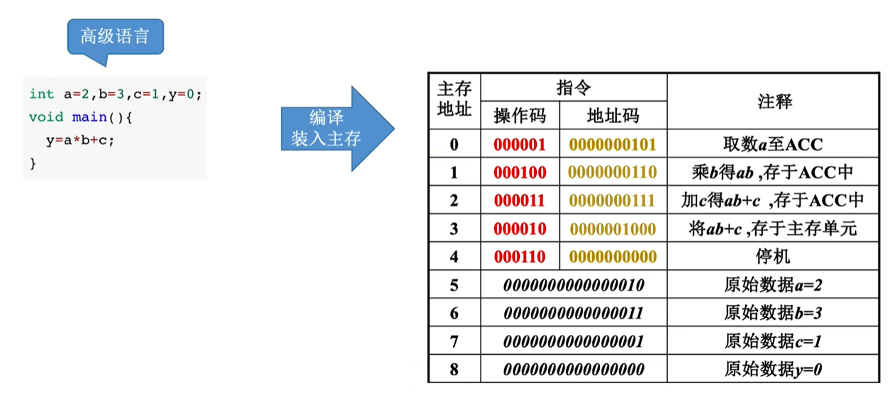
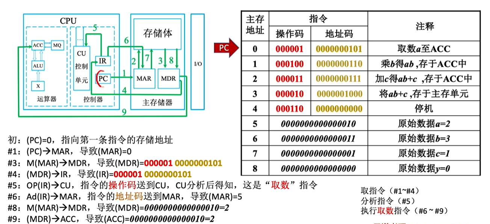

## *1.1 计算机的发展历程

## 1.2 计算机的系统层次结构

### 1.2.1 计算机硬件的基本组成

#### 1 早期冯诺依曼机的结构



冯诺依曼结构的特点：
1.计算机由五大部件组成
2.指令和数据以同等地位存放于存储器，可按地址寻访
3.指令和数据用二进制表示
4.指令由操作码和地址码组成
5.存储程序 (提前把数据和程序存入主存储器，一旦程序被激活，就无需干预，逐条执行到结束)**指令在存储器中顺序存放**
**6.以运算器为中心**  

#### 2现代计算机的结构   



**以存储器为中心**

CPU=运算器+控制器

上图简化后：





存储器包括主存和辅存，主存属于主机，辅存属于外设。

### 1.2.2 各个硬件的工作原理

### 1.主存储器的基本组成

MAR=4位

代表主存储器一共有$2^{4}$个存储单元

MDR=16位

代表主存储器的每个存储单元可存放16bit

```
易混淆：
一个字（word）=16bit 变量
1个字节（Byte）=8bit 常量
1B=1Byte 大B是字节 
1b=1bit 小b是比特
```

### 2.运算器的基本组成



###  3.控制器的基本组成 



### 4.计算机的工作过程

   

 高级语言编译链接变为机器语言，然后装入主存。

 

程序开始运行，PC指向0，然后向MAR发送PC所指的内容（即主存地址0），然后 MAR再去存储体里找主存地址为0的内容，并且发送给MDR，识别得到指令，然后再把MDR的内容发送给IR，IR再把操作码和地址码风别发给CU和MAR。

### 1.2.3 计算机系统的层次结构

 

**下层是上层的基础，上层是下层的拓展**

高级语言——>汇编语言——>机器语言

高级语言分为

解释语言：将源程序的逐句翻译并执行，每次运行都需要重新翻译。

编译语言：将源重新全部翻译成机器语言版本，此后每次执行时运行机器语言版本。


## 1.3 计算你机的性能指标 

### 1.机器字长

通常说的“32位机器或16位机器”，其中32和16就是机器字长。字长是字节（8位）的整数倍。 字长一般等于**通用寄存器的位数**或**ALU的宽度**，越长精度越高。 

2^10=K  2^20=M  2^30=G  2^40=T

### 2.数据通路宽度

是指数据总线一次所能并行传送信息的位数。这里所说的数据通路宽度是指外部数据总线的宽度，它与CPU内部数据总线宽度（内部寄存器的大小）有可能不同。

### 3.主存容量

是指主存储器所能存储信息的最大容量，通常以字节来衡量，也可以说字数×字长（如512K × 16位）来表示存储容量。其中MAR（memory address register 主存地址寄存器）的位数反映了存储单元的个数，MDR（memory data register 主存数据寄存器）的位数反映了存储单元的字长。

### 4.CPU性能指标 

CPU主频：CPU内数字脉冲信号震荡的频率。

CPU主频（时钟频率）= $ \frac{\Large 1}{\Large cpu时钟周期} $

CPI（Clock cycle Instruction）:执行一条指令所需的时钟周期数。（对于某个机器或某个程序来说，CPI指完成一条指令的平均周期。）

IPS（Instructions Per Seco）:每秒执行多少条指令。

IPS=$ \frac{\Large 主频}{\Large 平均CPI}$

FLOPS()：每秒执行多少次浮点运算


