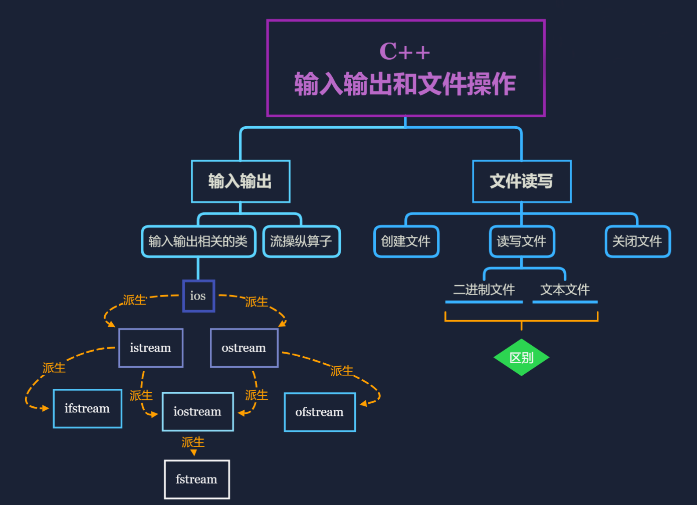
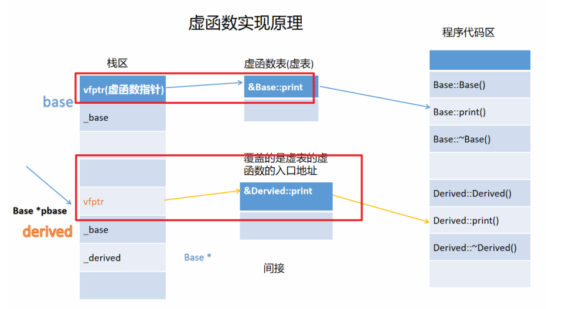
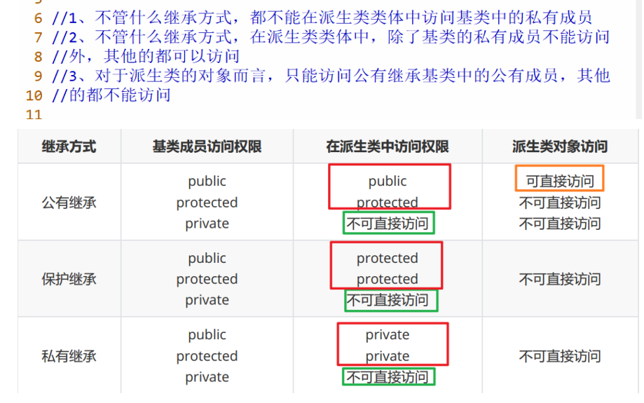

# c++线上短期班笔记

## 调包

### #ifndef 的作用

`#ifndef` 是 C/C++ 预处理器中的一个指令，用于条件编译。它的含义是 "if not defined"，即如果指定的标识符尚未被定义，则执行后面的代码。

```c++
#ifndef SOME_IDENTIFIER
#define SOME_IDENTIFIER

// 在这里放置要执行的代码

#endif // SOME_IDENTIFIER
```

当编译器遇到 #ifndef 时，它会检查后面的宏是否已经被定义。如果宏尚未被定义，则会继续编译后续代码，直到遇到 #endif。如果宏已经被定义了，则编译器会跳过后续代码，直接到达 #endif。

这种技术通常用于防止头文件被多次包含，从而避免重复定义问题。

### 两种不同的调用格式

```c++
#include"filename"//是用来调用用户自定义的头文件
#include<filename>//是用来调用编译器提供的标准库头文件
```


## 单例模式

一个类只有一个实例

### 1.懒汉模式，延迟初始化（用到类的时候才进行初始化）

缺点：不会自动释放， 可能会内存泄漏

```c++
class Singleton
{
private:
	static Singleton* instance;
private:
	Singleton() {};
	~Singleton() {};
	Singleton(const Singleton&);//拷贝构造函数，私有无法正常使用
	Singleton& operator=(const Singleton&);//重写赋值运算符
public:
	static Singleton* getInstance() //唯一用来创建和访问类的实例的方法
        {
		if(instance == NULL) 
			instance = new Singleton();
		return instance;
	}
};

// init static member
Singleton* Singleton::instance = NULL;
```

解决方法

1. 智能指针

2. 静态的嵌套类

### 2.静态的嵌套类

```c++
class Singleton
{
private:
	static Singleton* instance;//私有类指针
private://私有成员函数
	Singleton() { };
	~Singleton() { };
	Singleton(const Singleton&);//拷贝构造函数
	Singleton& operator=(const Singleton&);//赋值运算符
private://私有类
	class Deletor {//嵌套一个类，用该类的析构函数驱释放单例的内存
	public:
		~Deletor() {
			if(Singleton::instance != NULL)
				delete Singleton::instance;
		}
	};
	static Deletor deletor;//创建一个嵌套类的栈对象，程序结束时会自动调用对应的析构函数，用静态是因为静态类型会让所有的实例共享同一个静态对象。
public:
	static Singleton* getInstance() {
		if(instance == NULL) {
			instance = new Singleton();
		}
		return instance;
	}
};

// init static member
Singleton* Singleton::instance = NULL;
```

### 3.饿汉模式+atexit

### 4.pthread_once+atexit


## 只能生成堆对象或者栈对象

```c++
Student *s1=new Student();//这样创建的是堆对象
Student s2;//这样创建的是栈对象
```

堆（Heap）：

- 堆是程序运行时动态分配内存的区域，也称为自由存储区。
- 在堆上分配的内存由程序员手动分配和释放，具有较长的生命周期，直到程序员显式释放。
- 堆上分配的内存通常用于存储动态创建的对象、数组和其他复杂数据结构，以及需要动态调整大小的数据。
- 堆上的内存分配由操作系统的内存管理器来管理，通常以链表或二叉树等数据结构来组织和维护。

栈（Stack）：

- 栈是一种线性数据结构，用于存储函数调用期间的局部变量、函数参数和函数调用信息等。
- 栈上的内存由编译器自动管理，具有自动生命周期，函数调用结束时自动释放。
- 栈上分配的内存通常用于存储临时变量和函数调用期间的局部数据，以及函数的返回地址和调用堆栈。
- 栈的内存分配采用后进先出（LIFO）的方式，通过栈指针（stack pointer）来管理栈上的内存分配和释放。

### 一、类只能生成栈对象

把运算符 new/delete 进行重载，并放到private区域中，这样就不能通过new创建类的堆对象了。

### 二、类只能生成堆对象

因为栈对象会自动调用**析构函数**和**构造函数**，所以把析构函数设置为private类型，创建栈对象`Student s1;`就会报错，而堆对象因为需要自己调用delete，所以不受影响。

但是注意：直接调用析构函数已经是不可能，因为析构函数已经在`private`区域内部；
所以需要在类内部创建`destory`函数，这样在`destory`函数内部使用delete就可以被动调用析构函数了。

## 静态函数

有的时候类需要他的一下成员与类本身直接相关，而不是与类的各个对象保持关联。

**静态函数要在类的外部定义和初始化。**

### 静态函数的声明

静态函数可以声明为`public/private`:

1. **Public 静态成员函数**：
    - 如果静态成员函数被声明为公有（public），则它可以在任何地方被访问，包括类的外部和类的内部。
    - 外部代码可以直接通过类名加作用域解析运算符来调用公有静态成员函数。
2. **Private 静态成员函数**：
    - 如果静态成员函数被声明为私有（private），则只有类的成员函数和友元函数可以访问它，外部代码无法直接访问它。
    - 外部代码无法通过类名来调用私有静态成员函数，只能在类的成员函数或友元函数内部访问它。


## 函数指针和函数指针作为参数

### 一、函数指针作为结构体成员


### 二、函数指针作为函数参数

函数指针可以作为一个参数传递给另一个函数。这时函数指针的使用就像普通的常量和变量一样。当函数指针作为参数传递的时候，这时接收参数传递的函数通常需要根据这个指针调用这个函数。作为参数传递的函数指针通常表示`回调函数（Callback Functions）`。

函数指针声明如下:

```c++
return_type (*p_name)(arg_list);
//表示返回值为return_type，参数列表为arg_list的函数指针p_name.
```

#### 1. 什么是回调参数

回调函数就是一个通过函数指针调用的函数。如果你把函数的指针（地址）作为参数传递给另一个函数，当这个指针被用来调用其所指向的函数时，我们就说这是回调函数。

#### 2.回调参数在实际中有什么用

先假设有这样一种情况：我们要编写一个库，它提供了某些排序算法的实现（如冒泡排序、快速排序等等），为了能让库更加通用，不想在函数中嵌入排序逻辑，而让使用者来实现相应的逻辑；或者，能让库可用于多种数据类型（int、float、string），此时，该怎么办呢？可以使用函数指针，并进行回调。

例如，在C语言的通用工具库stdlib.h中，有如下一个函数原型：

```c++
void qsort(void *, size_t, size_t, int (comp*)(const void *, const void *))
```
这是在C通用工具库中声明的一个快速排序算法函数，其可以用来排序int类型、float类型以及字符串数据，可以按从小到大的顺序也可以按从大到小的顺序排序。其关键在于函数指针comp指向的函数的具体实现。


函数A作为参数传递给函数B时，函数B声明如下：

```c
int A(int a,int b);

B(arg_list,int (*pA)(int, int));
123
```

函数B调用如下：

```c
B(...，A);
1
```

例子：

```c++
int CmpAsc(int x, int y)
{
    //如果x>y返回1，否则返回0；
    if(x>y)return 1;
    else return 0;
}
void sort(int a[], int n, int (*cmp)(int,int))//最后一个参数为函数指针类型参数
{
    /*对数组a排序，排序原则由cmp指定，若cmp为真，表示两元素逆序*/
    for(int i=0;i<n-1;i++)
        for(int j=i+1;j<n;j++)
            if(cmp(a[i],a[j]))//调用传进来的函数指针
                swap(a[i],a[j]);
}

int main(int argc, const char * argv[]) {
    // insert code here...
    
    int a[6] ={8,2,1,3,4,5};
    sort(a, 6, CmpAsc);//CmpAsc函数名作为参数传递给函数sort
    for(auto &e:a)
        cout<<e<<" ";
    return 0;
}
```



## 输入输出流

- istream是用于输入的流类，cin就是该类的对象。
- ostream是用于输出的流类，cout就是该类的对象。
- ifstream是用于从文件读取数据的类。
- ofstream是用于向文件写入数据的类。
- iostream是既能用于输入，又能用于输出的类。
- fstream 是既能从文件读取数据，又能向文件写入数据的类。

### 一、流的三种分类 

1、如果是键盘或者显示器，也就是标准设备的输入与输出，将其称为标准的输入输出，也就是标准IO 

2、如果是以外存设备文件进行输入输出，文件的输入输出，文件IO 

3、如果是以程序（内存）进行输入输出，内存输入输出，串IO。 

### 二、流的四种状态

goodbit表明流是正常。
只有流的状态是goodbit的时候，才能进行正常的操作。可以使用good函数进 行查看。 

badbit表明流是异常的，是一种系统级别的错误，无法进行恢复。
可以使用bad函数进行查看。 

falibit表明流是异常的，是一种可以恢复的错误。
可以使用fail函数进行查看。

eofbit表明文件指针到达了文件末尾。可以使用eof函数进行查看。

## 文件I/O


## 友元

用来访问某个类中的私有成员，友元不受访问权限的控制。

重载函数想要访问另外一个类的私有成员，两个重载函数都要分别设置为类的友元。


有三种形式

### 普通函数形式


### 成员函数形式


### 友元类形式


## 运算符重载

为了能够让类类型能像内置类型一样进行正常运算。所以就需要进行运算符的重载，让类创建的对象直接可以像内置类型一样，进行运算。

### 规则

- 不能下列运算符

    ​		成员访问运算符 .

    ​		成员指针运算符 .*

    ​		三目运算符 ?:

    ​		作用域限定符 ::

    ​		sizeof运算符

- 至少有一个参数是类类型或者枚举类型

- 重载运算符后，操作数的个数，顺序不能改变，也不能改变运算符的优先级和结合性
- 不能臆造不存在的运算符
- 逻辑运算符重载后失去短路求值特性

### 运算符重载3种的形式

普通函数的形式

成员函数的形式

友元的形式

### 特殊运算符的重载

复合赋值运算符的重载

```c++
Complex &operator+=(const Complex &rhs){
    cout << "Complex &operator+=(const Complex &)" << endl;
    _dreal += rhs.dreal;
    _dreal += rhs.dimag;
    
    return *this;
}
```

自增自减运算符的重载

```c++
//前置++
Complex &operator++(){
    cout << "Complex &operator++()" << endl;
    ++_dreal;
    ++_dreal;
    
    return *this;
}

//后置++
Complex &operator++(int){//int只起到标识符的作用，没有传参含义
    Complex com(*this);
    _dreal++;
    _dimag++;
    
    return com;
}
//前置++的效率比后置++要高。前置++返回的是左值，后置++返回的结果是右值。
```


输入输出流运算符的重载

```c++
//输出流运算符不能用成员函数的形式来重载，因为隐含的this指针参数会破坏操作数os与对象的顺序
friend std::ostream &operator<<(std::ostream &os,const Complex &rhs);
std::istream &operator>>(std::istream &is,Complex&rhs)
{
    cout<<"std::istream &operator>>(std::istream &,Complex &);"
        readDouble(is,rhs._dreal);
    	readDouble(is,rhs._dimag);
    	/*is>>rhs._dreal>>rhs.dimag;*/
    
    return is;
}
```

函数调用运算符的重载

```c++
//如果一个类中重载了函数调用运算符，那么该类创建的对象称为函数对象
class MyFunction {
public:
    // 重载函数调用运算符
    int operator()(int a, int b) {
        return a + b;
    }
};

int main() {
    MyFunction add; // 创建一个 MyFunction 类的实例

    // 通过实例调用重载的函数调用运算符
    int result = add(3, 4);

    std::cout << "Result of addition: " << result << std::endl;

    return 0;
}
//通过实例add来调用函数调用运算符，就像函数一样
```

下标访问运算符

```c++
char &operator[](size_t idx){
    if(idx < size()){
        return _pdata[idx];//防止下标越界
    }
    else{
        static char nullchar ='\0';
        return nullchar;
        /*return a;*/
    }
}
```

箭头与解引用运算符的重载

```c++
//重载箭头访问运算符
Data *operator->()
{
    return _pdata;
}

Data &operator*()
{
    return *_pdata;
}
```

## 虚函数

虚函数是在基类中声明的可以被派生类重写的函数。通过在基类中声明虚函数，可以实现运行时的多态性，使得通过基类指针或引用调用虚函数时，根据实际对象的类型来决定调用哪个版本的函数。

具体来说，虚函数的特点包括：

- 虚函数通过在基类中使用 `virtual` 关键字声明，以指示编译器进行动态绑定。
- 派生类可以重写（覆盖）基类中的虚函数，提供自己的实现。
- 当通过基类指针或引用调用虚函数时，实际调用的是指向或引用的对象的实际类型的函数版本，而不是基类中的函数。

以下是一个示例代码：

```c++
#include <iostream>
//基类 Shape
class Shape {
public:
    virtual void draw() {
        std::cout << "Drawing a shape." << std::endl;
    }
};
//派生类 circle
class Circle : public Shape {
public:
    void draw() override {
        std::cout << "Drawing a circle." << std::endl;
    }
};
//派生类 Rectangle
class Rectangle : public Shape {
public:
    //重写基类虚函数
    void draw() override {
        std::cout << "Drawing a rectangle." << std::endl;
    }
};

int main() {
   Shape* shapePtr; // 基类指针

    Circle circle; // 创建 Circle 对象
    Rectangle rectangle; // 创建 Rectangle 对象

    shapePtr = &circle; // 将基类指针指向 Circle 对象
    shapePtr->draw(); // 通过基类指针调用虚函数，将会调用 Circle 类中的 draw() 函数

    shapePtr = &rectangle; // 将基类指针指向 Rectangle 对象
    shapePtr->draw(); // 通过基类指针调用虚函数，将会调用 Rectangle 类中的 draw() 函数

    return 0;
}
```

在这个示例中，通过基类指针调用 `draw()` 函数时，实际调用的是指针指向的对象的实际类型的 `draw()` 函数版本。这种行为称为动态绑定，实现了多态性的效果。

### 虚函数的原理

当基类定义虚函数之后，就会在该类对象的内存布局的前面多一个指针，该指针叫做虚函数指针，该指 针指向了一张虚函数表，简称虚表，虚表里面存放的是虚函数的入口地址。如果派生类继承基类之后， 会将虚函数继承到派生类中，那么派生类对象的布局前面也会多一个虚函数指针，该虚函数指针会指向 派生类自己的虚表，该虚表中存放的是吸收过来的虚函数的入口地址，但是如果派生类重写了该虚函数，那么就会用派生类自己的虚函数的地址进行覆盖。



## string的底层实现


## 继承

继承就是从既有类创建新类的过程

### 语法

```C++
class 基类/父类的类名
{
//数据成员
//成员函数
};
class 派生类/子类的类名 : public/protected/private 基类/父类的类名
{
//数据成员
//成员函数
};

```

### 派生类生成的三个步骤

- 吸收基类的成员
- 改造基类的成员
- 新增自己的新的成员

**总结：吸收、改造、新增。**

### 继承的局限

- 构造函数与析构函数是不能被继承的
- 用户重载的operator new/delete是不能被继承的
- 用户重载的赋值运算符函数也是不能被继承的
- 友元关系也是不能被继承的 

### 不同继承方式的特点



### 三种访问运算符的说明

- public

    - 可以被任何函数访问，包括类的成员函数、友元函数和外部代码。

    - 类的外部也可以访问。

    - 使用public继承时，基类的public和protected成员将保持其在派生类中的访问权限。

- private

    - 只能被同一个类内的其他成员函数访问，不能被外部代码访问。

    - 私有成员对类的外部是不可见的，外部代码无法直接访问。
    - 使用private继承时，基类的public和protected成员将变成派生类的私有成员，不能被派生类外部访问。

- protected

    - 保护成员可以被同一个类内的其他成员函数访问，也可以被派生类的成员函数访问，但不能被类的外部代码直接访问。

    - 保护成员对于类的外部成员是不可见的，外部代码无法直接访问。
    - 如果使用protected继承，基类的public和protected成员将变为派生类的保护成员，不能被派生类外部访问。

### 私有继承与保护继承的区别

保护继承基类中的非私有成员，在后续可以无限保护继承下去，并且可以被访问；但是私有继承基类中的非私有成员，当继承两次以上，在后续的派生类中是不能被访问的。

**默认继承方式是私有的。**

## 派生类对象的创建与销毁

### 派生类构造函数的形式

为了完成从基类吸收过来的数据成员的初始化，所以在怕死恒磊构造函数的初始化列表中借助基类的构造函数完成从基类吸收过来的数据成员的初始化。

```c++
class Base {
protected:
    int x;
public:
    Base(int val) : x(val) {
        // 构造函数初始化列表中初始化成员变量 x
    }
};

class Derived : public Base {
private:
    int y;
public:
    Derived(int val1, int val2) : Base(val1), y(val2) {
        // 构造函数初始化列表中调用基类的构造函Base(val1)，并初始化派生类成员变量 y
    }
};
```

### 四种情况

- 如果**派生类显式定义了构造函数，而基类没有显式定义构造函数**，那么在创建派生类的对象时，派生类的相应构造函数会被自动调用，并且会**隐式地调用基类的默认构造函数**（无参构造函数），来完成基类部分的初始化。
- 如果**派生类没有显式定义构造函数而基类有显式定义构造函数**，则基类必须拥有默认构造函数(无参构造函数)，否则就会报错。
- 如果**派生类有构造函数，基类有默认构造函数**，则创建派生类的对象时，基类的默认构造函数会自动的调用，如果你想调用基类的有参构造函数，必须要在派生类构造函数的初始化列表中显示调用基类的有参构造函数。
- 如果**派生类和基类都有构造函数，但基类没有默认的无参构造函数**，即基类的构造函数均带有参数，则派生类的每一个构造函数必须在其初始化列表中显式的去调用基类的某个带参的构造函数。如果派生类的初始化列表中没有显式调用则会出错，因为基类中没有默认的构造函数。

总结：不管基类与派生类的构造函数的形式如何，当创建派生类对象的时候，会调用派生类的构造函 数，为了完成从基类吸收过来数据成员的初始化，会默认调用基类的无参构造函数，如果基类的无参构 造函数没有提供，那么就会报错，所以最好可以显示的在派生类的构造函数的初始化列表中，将需要调 用的基类的构造函数显示的写出来，那么这样就不会报错了。

### 构造函数的调用顺序

- 完成对象所占整块内存的开辟，由系统在调用构造函数时自动完成。
- 调用基类的构造函数完成基类成员的初始化。
-  若派生类中含对象成员、const成员或引用成员，则必须在初始化表中完成其初始化。 
- 派生类构造函数体执行。

### 析构函数的调用顺序

当派生类对象销毁的时候，会调用派生类的析构函数，当派生类的析构函数完成后，基类的析构函数会被自动调用

析构函数的执行顺序：

- 先调用派生类的析构函数
- 如果派生类中有对象数据成员，那么会接着执行类对象成员的析构函数
- 最后指向基类的析构函数

## 多基类的派生类

### 形式

```c++
class 基类1{
};
class 基类2{
};
class 基类3{
};
class 派生类
: public/protected/private 基类1
, public/protected/private 基类2
, public/protected/private 基类3
{
};
```

### 特点

对于多继承而言，最好对每个基类都写继承方式，继承方式的关键字是不能共用的，如果那个基类不写继承方式，那就是默认的继承方式private

对应多继承而言，基类构造函数的执行顺序与其在派生类构造函数的初始化列表中没有关系，只与派生类继承基类的基类的先后顺序有关。

```c++
class A{};
class B{};
class C{};

class D
:public B//与这个顺序有关
,public C//与这个顺序有关
,public A//与这个顺序有关
{
public:
    D()//派生类调用基类的析构函数，
    : C()//执行顺序与这个无关
    , A()//执行顺序与这个无关
    , B()//执行顺序与这个无关
    {
        cout<<"D()"<<endl;
    }
}
```

### 成员函数的访问冲突

```c++
void test(){
    D d;
    d.A::print();//用类名加作用域限定符的形式来解决成员函数名重复的问题
    d.B::print();
    d.C::print();
}
```

### 数据成员存储的二义性

如果一个派生类类继承自两个或多个基类，而这些基类又共同继承自同一个基类，就会导致派生类中存在同名成员变量或函数的多重定义，从而引发冲突和混乱的问题。

用虚拟继承可以解决上述问题。

#### 虚拟继承

```c++
#include <iostream>
using namespace std;

class Animal {
public:
    int legs;
};

// 虚拟继承的基类
class Mammal : virtual public Animal {
public:
    bool hasHair;
};

// 虚拟继承的基类
class Bird : virtual public Animal {
public:
    bool canFly;
};

// 派生类，同时继承自 Mammal 和 Bird
class Bat : public Mammal, public Bird {
public:
    Bat() {
        legs = 2;  // 访问虚拟基类 Animal 的成员
        hasHair = true;  // 访问 Mammal 的成员
        canFly = true;   // 访问 Bird 的成员
    }

    void printDetails() {
        cout << "Legs: " << legs << endl;
        cout << "Has Hair: " << hasHair << endl;
        cout << "Can Fly: " << canFly << endl;
    }
};

int main() {
    Bat bat;
    bat.printDetails();
    return 0;
}

```

在这个例子中，`Mammal` 和 `Bird` 类都通过虚拟继承从 `Animal` 类继承，因此在 `Bat` 类中只会有一个 `Animal` 类的成员变量 `legs`，而不会出现多次复制。这样可以避免菱形继承问题，确保成员变量 `legs` 在 `Bat` 类中只有一份拷贝。

通过虚拟继承，我们能够更清晰地表示派生类与基类之间的关系，避免了多次继承带来的冗余和混乱。

### 基类和派生类对象间的转换

类型适合，派生类对象可以适用于基类对象。

- 可以将派生类对象赋值给基类对象 `base = derived;`
- 可以将基类的引用绑定到派生类对象 `Base &ref = derived`
- 可以将基类的指针指向派生类的对象 `Base *pbase = &derived`

**派生类的实例可以转化为基类的实例**

**基类的实例不能转化为派生类的实例**

### 派生类对象间的赋值控制

1、如果用户定义了基类的拷贝构造函数，而没有定义派生类的拷贝构造函数，那么在用一个派生类对象初始化新的派生类对象时，两对象间的派生类部分执行缺省的行为（编译器自动生成默认拷贝构造函数，挨个复制，浅复制非基本类型的成员变量），而两对象间的基类部分执行用户 定义的基类拷贝构造函数。

 2、如果用户重载了基类的赋值运算符函数，而没有重载派生类的赋值运算符函数，那么在用一个派生类对象给另一个已经存在的派生类对象赋值时，两对象间的派生类部分执行缺省的赋值行为，而两对象间的基类部分执行用户定义的重载赋值函数。

3、如果用户定义了派生类的拷贝构造函数或者派生类的赋值运算符函数，则在用已有派生类对象初始 化新的派生类对象时，或者在派生类对象间赋值时，将会执行用户定义的派生类的拷贝构造函数或者赋 值运算符函数，而不会再自动调用基类的拷贝构造函数和基类的赋值运算符函数，这时，通常需要用户 在派生类的拷贝构造函数或者派生类的赋值运算符函数中显式调用基类的拷贝构造或赋值运算符函数。 

### 禁止复制

特点：不允许对象的复制和赋值

1、将拷贝构造函数和复制运算符设为私有（c++98）

2、将拷贝构造函数与复制运算符函数设置为=delete(c++11)

> =delete是c++11中用来显式的禁用类的某些成员函数的方法，如： MyClass() = delete;//禁用构造函数

3、设置一个基类，将基类的拷贝构造函数与复制运算符函数设置为私有的或者=delete，然后让派生类继承，特殊派生类不去写拷贝构造函数与复制运算符函数

## 成员初始化列表访问

成员初始化列表（Member initializer list）是在 C++ 中用于初始化类成员变量的一种语法结构。它出现在构造函数的定义中，在构造函数的参数列表后面使用冒号 `:` 跟随着成员变量的初始化。

具体的语法如下：

```c++
cppCopy codeclass MyClass {
private:
    int myInt;

public:
    MyClass(int val) : myInt(val) {
        // 在构造函数的参数列表后使用成员初始化列表来初始化成员变量
    }
};
```

在上面的例子中，`myInt(val)` 就是成员初始化列表，用来初始化 `MyClass` 类中的 `myInt` 成员变量。其中 `val` 是构造函数的参数，用来给 `myInt` 赋值初始化。

通过成员初始化列表进行初始化的好处包括：

- 提高了初始化的效率：使用成员初始化列表可以减少临时对象的创建和销毁，提高了初始化的效率。
- 避免了成员变量未初始化的问题：成员初始化列表的初始化在对象构造之前完成，可以避免成员变量未初始化的问题。

成员初始化列表通常在构造函数中使用，它允许在对象创建时对类成员进行初始化，并且提供了一种简洁、清晰的语法结构。

**如果成员是const、引用，或者属于某种为提供默认构造函数的类类型，我们必须通过构造函数初始值列表为这些成员提供初值。**

## 多态

### 多态的基本概念

抽象、封装、继承、多态

### 定义

对于同一种指令（警车鸣笛），针对不同的对象（警察，普通人，小偷），产生不一样的行为（抓小 偷、正常反应、跑）

### 分类

静态多态：发生的时机在编译的时候。包括：函数重载、运算符重载、模版

```c++
int add(int, int);
double add(double, double);
long add(long, long);
//string add(string, string);
add("hello", "world");
```

动态多态；发生的时机在运行的时候。虚函数可以体现动态多态。

### 动态多态被激活的五个条件

- 基类要定义虚函数
- 派生类要重写（覆盖）该虚函数
- 创建派生类对象 
- 基类的指针指向（引用绑定）派生类对象 
- 基类的指针（引用）调用该虚函数

### 哪些函数不能被设置为虚函数

- 普通函数，因为虚函数必须是成员函数，而普通函数是非成员函数，与定义不符。
- 静态成员函数，因为静态成员函数没有隐含的this指针，而且静态成员函数是被该类的所有对象共享的。
- 内联函数，内联的含义发生在编译的时候，而虚函数体现多态是通过运行的时候。
- 友元函数，只有成员函数的友元函数是可以设置为虚函数的。
- 构造函数，构造函数不能被继承。

## 虚函数的访问

### 指针进行访问

```c++
void func(Base *pbase)
{
    pbase->print();//对应同一种指令
}
//基类的指针pbase指向基类对象与派生类对象，用基类的指针调用虚函数print体现了多态
```


### 引用进行访问

引用的底层实现就是指针，故可以

### 使用对象进行访问

直接使用对象进行访问的时候，在编译的时候就能缺的调用的是哪个对象的虚函数，所有就不能体现动态多态，将其称为静态联编

```c++
base.print();
derived.print();
```

### 在其他的普通成员函数中访问

在编译的时候还不能确定调用的是哪个对象的虚函数，故可以

### 在构造函数与析构函数访问

不能体现动态多态。

```c++
class Father
    :public grandpa
    {
        public:
        father()
            :Grandpa()
            {
                cout << "Father()" << endl;
                this->funcl();//father类的派生类还不完整
            }
        ~Father()
        {
            cout << "~Father()" << endl;
            func2();//此时father类的派生类已经销毁了
        }
    }
```

问题：虚函数与动态多态是不是等价的

答案：动态多态要体现必须要有虚函数：但是有虚函数不一定能体现动态多态。

## 抽象类

两种抽象类的实现方式

### 纯虚函数

```c++
class 类名
{
    public:
    virtual 返回类型 函数名(参数包) = 0;
};
```

**包含纯虚函数的类不能实例化，只有当派生类实现了基类中的所有纯虚函数，才能实例化对象**。

使用纯虚函数的目的是为了定义一个接口，规定了子类需要实现的方法，从而达到统一规范、提高代码得到可维护性和可拓展性的目的。

在派生类中如果没有实现纯虚函数，那么派生类也是一个抽象类，不能实例化对象。只有当派生类实现了基类中的所有纯虚函数，才能实例化对象。

使用纯虚函数的目的是为了定义一个接口，规定了子类需要实现的方法，从而达到统一规范、提高代码的可维护性和可拓展性的目的。

### 将构造函数用protected修饰的类是抽象类

```c++
class Base
{
    protected:
    Base()
    {
        cout << "Base()" <<endl;
    }
};
class Derived:public Base{
    public:
    Derived():Base(){
        cout << "Derived()" <<endl;
    }
};
```


## 虚析构函数

### 内存泄漏问题

通常情况下，**当基类指针指向派生类对象时，如果基类的析构函数不是虚函数，那么只会调用基类的析构函数，而不会调用派生类的析构函数**。这可能导致派生类中的资源没有得到正确释放，从而产生内存泄漏或未定义的行为。

### 解决方法

将基类的析构函数声明为虚函数，当基类的析构函数是虚函数时，删除实例对象时，会根据实际对象的类型调用相对应的析构函数，确保释放派生类中的资源。

```c++
//如果将基类idea析构函数设置为虚函数，那么派生类的析构函数会自动变为虚函数,认为其是一种重写(c++唯一的名字不一样的重写)
//原因：对于任何一个类而言，析构函数是唯一的，不能重载
//对于编译器而言，只要类定义了析构函数，将其改名为~destructor(),对于编译器而言，这就是一个重写
virtual ~Base()
{   
	cout << "~Base()" << endl;
    if(_pbase)
    {
        delete[] _pbase;//用 _pbase=new int[size];生成的空间  
        _pbase = nullptr;
    }
}   

void test()
{   
    //内存泄漏；派生类中的数据成员申请的空间没有回收
    Base *pbase = new Derived("hello","world");//基类指针指向派生类实例
    pbase->print();
    /* delete dynamic_cast<Derived *>(pbase);//ok */
    //把基类指针转换为派生类指针，然后再删除
    //delete pbase会执行delete表达式的工作步骤
    //1、执行该种类型的析构函数pbase->~Base()
    //2、执行operator delete
    delete pbase;
    //基类指针指向派生类对象，如果基类的析构函数不是虚函数，那么只会调用基类的析构函数，而不会调用派生类的析构函数。这样就会导致派生类中可能存在的资源没有得到正确释放，从而产生内存泄漏。
    pbase = nullptr;
}
```

## 重载

在同一个作用域中，函数名字相同，但是参数列表是不一样（参数的类型、参数的个数、参数的 顺序），仅仅只靠函数的返回类型是不能区分重载的。

## 覆盖（重写）

在基类与派生类中，函数的名字相同，参数列表与返回类型都相同，并且函数是**虚函数**。

## 隐藏（重定义）

在基类与派生类中，**函数名字相同**，也就是派生类中的函数的名字与基类中函数的名字是相同。即：只需要函数的名字是相同的，至于是不是虚函数没有关系。基类与派生类中的数据成员也存在隐藏。

## 虚表

虚表（vtable）是 C++ 中实现多态的一种机制，用于实现虚函数的动态绑定。每个含有虚函数的类都会有一个对应的虚表，其中存储了该类的虚函数的地址。

具体来说，虚表是一个指针数组，每个指针指向一个虚函数的地址。当一个类中存在虚函数时，编译器会在其对象的内存布局中添加一个指向虚表的指针（通常称为虚指针或虚函数表指针），这样在运行时就可以通过这个指针找到类的虚表，从而调用正确的虚函数。

```c++
#include <iostream>
using namespace std;

class Base {
public:
    virtual void foo() {
        cout << "Base::foo()" << endl;
    }
};

class Derived : public Base {
public:
    void foo() override {
        cout << "Derived::foo()" << endl;
    }
};

int main() {
    Base *ptr = new Derived();
    ptr->foo(); // 动态绑定，调用 Derived::foo()
    delete ptr;
    return 0;
}
```

在这个例子中，`Base` 类中定义了虚函数 `foo()`，`Derived` 类继承自 `Base` 并重写了 `foo()` 函数。在 `main()` 函数中，通过基类指针 `ptr` 创建了一个 `Derived` 类的对象，并调用了 `foo()` 函数。由于 `foo()` 函数是虚函数，因此会根据对象的实际类型动态绑定，最终调用 `Derived::foo()`。

在这个过程中，编译器会在 `Base` 对象的内存布局中添加一个指向虚表的指针，这个虚表中存储了 `Base` 类的虚函数 `foo()` 的地址。当通过基类指针调用虚函数时，实际上是根据这个指针找到对应的虚表，从而调用正确的虚函数。

## 虚拟继承

### virtual的三个特征

存在、间接和共享

#### 在虚函数中的解释

- 虚函数是存在的
- 虚函数必须要通过一种间接的运行时(而不是变异时)机制才能够激活（调用）的函数
- 共享性表现在虚基类会在虚继承体系中被共享，而不会出现多份拷贝

#### 在虚拟继承中的解释

- 即表示虚继承体系和虚基类确实存在

- 间接性表现在当访问虚基类的成员时统一也必须通过某种间接机制来完成(通过**虚基表**来完成)

- 共享性表现在虚基类会在虚继承体系中被共享，而不会出现多份拷贝


### 虚拟继承的形式
```c++
class Dervied
    :virtual public/protected/private Base
    {   
    };

class Dervied
    :public/protected/private virtual Base
    {
    };
```

## 引用

### 什么是引用

引用是一种特殊的数据类型，允许我们创建一个已存在变量的别名。

```c++
#include <iostream>
using namespace std;

int main() {
    int original = 42;
    int &ref = original; // 声明引用变量ref，它是original的别名

    cout << "Original: " << original << endl; // 输出原始变量的值
    cout << "Reference: " << ref << endl; // 输出引用变量的值

    // 修改引用变量，实际上是修改了原始变量
    ref = 100;

    cout << "Original after modification: " << original << endl; // 输出修改后的原始变量的值
    cout << "Reference after modification: " << ref << endl; // 输出修改后的引用变量的值

 return 0;
}
```

上面的例子中，`ref`是`original`的引用，修改`ref`的值实际上会修改`original`的值，因为他们指向相同的内存地址。这是引用类型的一个重要特性，可以用来在函数间传递参数，实现更高效的函数调用。

### 引用和指针的区别


在 C++ 中，引用和指针都可以用来间接访问变量，但它们之间有几个关键的区别：

1. **语法和操作符**：
    - 引用使用 `&` 符号进行声明，而指针使用 `*` 符号进行声明。
    - 引用在声明后不能重新绑定到另一个变量，而指针可以在运行时重新指向不同的变量或空地址。
    
2. **空值**：
    - 引用在声明后必须初始化，不能指向空值（nullptr）。
    - 指针可以被赋值为空值，也可以在声明后不立即初始化。
    
3. **内存管理**：
    - 引用不需要像指针一样进行内存分配和释放，因为它们必须在声明时初始化，并且一旦绑定到一个对象，就无法重新绑定到另一个对象。
    - 指针需要手动进行内存管理，包括分配和释放内存，以避免内存泄漏或悬空指针。
    
4. **安全性**：
    - 由于引用在声明后不能重新绑定，因此可以更安全地使用，避免了一些潜在的空指针错误。
    - 指针的使用可能会导致空指针引用和悬空指针问题，需要额外的谨慎来确保程序的安全性。
    
5. **函数参数传递**：
    - 使用引用作为函数参数，可以实现函数内部对实参进行修改，而不需要使用指针的间接访问。
    - 使用指针作为函数参数时，需要使用解引用操作符 `*` 来访问指针所指向的变量，或者使用指针的地址来修改其所指向的变量。
    
    ### 函数中使用引用类型和指针类型的区别
    
    ```c++
    // 函数声明，参数为引用类型
    void addOne(int& num) {//////////////////////
        num += 1;
    }
    int main() {
        int number = 5;
        // 使用引用类型作为参数传递
        addOne(number);
    }
    
    // 函数声明，参数为指针类型
    void addOne(int* ptr) {///////////////////////
        // 检查指针是否为空
        if (ptr != nullptr) {
            // 对指针所指向的值执行加一操作
            (*ptr) += 1;
        }
    }
    int main() {
        int number = 5;
        // 使用指针类型作为参数传递
        addOne(&number);
    }
    ```
    
    

## 深复制和浅复制

1. **浅复制**：
    - 浅复制仅复制对象的值，而不复制动态分配的内存地址。这意味着新对象和原始对象将共享同一块内存，其中包含指向动态分配的内存的指针。因此，如果其中一个对象修改了内存中的数据，另一个对象也会受到影响。
    - 浅复制通常只涉及对象的表面层次，而不考虑对象中可能存在的嵌套结构。
2. **深复制**：
    - 深复制会递归地复制对象及其所有嵌套的对象，包括动态分配的内存。这意味着新对象拥有一份完全独立的内存副本，而不会与原始对象共享任何资源。
    - 深复制确保了对象之间的独立性，因此对其中一个对象的修改不会影响另一个对象。

## 类型转换

### 1.从其他类型向自定义类型转换

往往是隐式转换。需要构造函数做支撑

```c++
Point pt2 = 100;
//pt2 是Point类型，而100是int类型
//此时右值调用了隐式转换，调用了Point类的构造函数，把100转换为了一个point类型的临时对象(匿名对象)，然后又调用拷贝构造函数来给pt2赋值
```

### 2.从自定义类型向其他类型转换

类型转换函数

```c++
//1、必须是一个成员函数
//2、函数没有参数列表
//3、函数没有返回类型
//4、在函数体重指向return语句，返回目标类型的变量
//5、一般不建议使用这个语法
operator int (){//本质是类型转换运算符的重载
    cout << "operator int()" << endl;
    return _ix + _iy;
}

void test2(){
    //从自定义类型向其他类型转换
    Point pt(1,2);
    cout << "pt = " << pt << endl;
    cout << endl;
    int ix = pt;//此处调用了类型转换函数
    cout << "ix = " << ix << endl;
}
```


##  左值引用和右值引用

### 左值和右值

左值有持久的状态，而右值要么是字面常量，要么是在表达式求值过程中创建的临时对象。

```C++
int a=3;
int b=4;
&a;//ok
&b;//ok
//可以给a和b取地址，代表a和b是左值
&(a+b);//error
//不能给(a+b)取地址，它是右值

int *pflag=&a;
&pflag;//ok
&*pflag;//ok(先解引用pflag,然后取地址)
//pflag是左值，*pflag也是左值

string s1("hello");
string s2("world");//s1,s2为栈对象
&s1;//ok,左值
&s2;//ok，左值
&(s1+s2);//error，右值
```


### 特例：左值引用类型

左值引用类型就是常规的引用类型，区别于c11新添加的右值引用类型

```c++
int number=10;
int &ref = number;
&number;//ok,number本身是左值
&ref;//ok，ref也是左值，number的别名

int &ref2 = 10;//error
/* &10; error,10是右值，不能取地址*/
//非const左值引用类型，是不能与右值进行绑定的
//10是字面常量，是右值，是不能和左值引用进行绑定的

const int &ref3 = 10;//ok
const int &ref4 = number;//ok
//const左值引用可以绑定左值也可以绑定右值
```

**普通左值引用类型不能绑定到右值上**

**const类型左值引用可以绑定到右值上，也可以绑定到左值**

### c11新增：右值引用类型

```c++
int value =10;
int &&ref=10;//ref是右值引用 
int &&ref2=value;//error，非const右值引用不能识别左值
```

## 移动构造函数

移动构造函数（Move Constructor）是 C++11 引入的一种特殊的构造函数，用于实现对象的移动语义。它允许将资源（如动态分配的内存、文件句柄等）从一个对象“移动”到另一个对象，而不是进行传统的深度复制。

移动构造函数通常接受一个右值引用（Rvalue Reference）作为参数，表示可以被移动的对象。右值引用通常使用 `&&` 符号来声明。移动构造函数的作用是将资源从传入的临时对象或者即将销毁的对象中“窃取”，并将其转移到正在构造的新对象中。

```c++
class MyClass{
public:
    MyClass(MyClass&& other) noexcept{
        // 移动 other 中的资源到当前对象
    }
};
```

其中`&&`符号表示右值引用，表示传入的参数是一个临时对象或者一个可以被移动的对象。

移动构造函数通常执行以下操作：

1. 将源对象的资源指针设置为 nullptr，以避免源对象析构时释放资源。
2. 将资源的所有权转移给目标对象。
3. 在必要时进行资源的浅拷贝，以确保源对象的析构不会影响到目标对象。

使用移动构造函数可以避免不必要的资源拷贝，提高了代码的效率和性能。在需要频繁创建、销毁临时对象或进行大规模数据结构操作时，移动构造函数特别有用。

## 移动赋值函数

```c++
String &operator=(String &&rhs){
    if(this !=&rhs)//1.自移动
    {
        delete [] _pstr;//2.释放操作数
        _pstr = nullptr;
        
        -pstr = rhs._pstr;//3.浅拷贝
        rhs._pstr = nullptr;
    }
    return *this;
}
```

## std::move函数

```c++
//std::move可以将左值转换为右值，但是本身是没有什么移动的含义，本质上只是做了一个强转static_cast<T &&>(value)
s2 = std::move(s2);
/*&s2;//ok */
cout << "s2 = "<< s2<<endl;
```

也就是返回函数的返回结构是右值，但是value以前是左值还是右值不受std::move的影响

## 移动语义和拷贝语义

将拷贝构造函数与赋值运算符函数称为具备拷贝语义的函数

将移动构造函数与移动赋值函数称为具有移动语义的函数

具有移动语义的函数优先于具备拷贝语义的函数执行

## RAII原理（资源获取即初始化）

本质：利用栈对象的生命周期管理资源，当栈对象的生命周期达到的时候，会自动执行析构函数。

特征

- 在构造函数中初始化资源或者托管资源
- 在析构函数中释放资源（回收资源）
- 提供若干访问资源的方法
- 一般不允许赋值或者复制（对象语义）

对象语义：不允许赋值或者复制，不提供拷贝构造函数与赋值运算符函数

值语义：允许复制或者赋值，具备拷贝构造函数与赋值运算符

RAII可以用来管理其他资源：**例如文件、网络连接、互斥锁、数据库连接等**

如下是用栈对象来管理堆空间的一个例子：

```c++
#include <iostream>

class MyArray {
private:
    int* data;
    int size;

public:
    MyArray(int sz) : size(sz) {
        // Allocate memory on the heap
        data = new int[size];
        std::cout << "Allocated memory for array of size " << size << std::endl;
    }
    ~MyArray() {
        // Deallocate memory
        delete[] data;
        std::cout << "Deallocated memory for array of size " << size << std::endl;
    }

    // Other member functions can be added as needed
};
int main() {
    // Creating a MyArray object on the stack
    MyArray arr(5); // Allocates memory for an array of size 5
    // Do something with the array...
    return 0;
} // arr goes out of scope here, memory is deallocated automatically

```

上面例子中，创建了一个数组类，用数组类的对象来管理数组空间的分配和销毁。而数组类就是堆空间。

## 智能指针

用来简化内存管理，能够实现自动分配内存和释放内存，避免了因为忘记而导致的内存泄漏。

### auto_ptr（已废弃）

特点：

1. **所有权管理**：`auto_ptr` 拥有所管理的对象的==所有权==。当 `auto_ptr` 被销毁时，它所拥有的对象会被自动释放。
2. **所有权转移**：`auto_ptr` 支持所有权的转移。可以通过拷贝构造函数或赋值操作符来转移对象的所有权，使得资源的所有权可以从一个 `auto_ptr` 转移到另一个。
3. **空指针检查**：`auto_ptr` 在默认构造函数中会将指针初始化为空指针（nullptr），并且在析构时会自动释放资源，因此不会导致悬空指针问题。
4. **简单**：相对于其他智能指针，`auto_ptr` 的实现相对简单，因此在某些情况下可能会更轻量级。

缺陷：

1. **不适用于容器**：由于所有权转移的问题，`auto_ptr` 不能直接用于标准库容器中。如果将一个拥有资源所有权的 `auto_ptr` 存储在容器中，可能会导致资源的所有权转移问题。
2. **不支持数组**：`auto_ptr` 不适用于动态数组的管理。它无法正确释放动态数组，因为它只使用 `delete` 而不是 `delete[]` 来释放资源。
3. **不提供自定义删除器**：`auto_ptr` 不提供自定义删除器的功能，这意味着无法灵活地指定在释放资源时所需执行的操作。
4. **不支持多态**：`auto_ptr` 不支持多态对象的所有权管理，因为它的析构函数不是虚函数。这可能导致在处理多态对象时的未定义行为。
5. **已被废弃**：由于上述缺陷，`auto_ptr` 在 C++11 标准中被废弃。现代 C++ 推荐使用更安全和更强大的智能指针，如 `unique_ptr`、`shared_ptr` 和 `weak_ptr`。

### unique_ptr

特点

提供==独占所有权==，意味着同一时间只能有一个`unique_ptr`指向某个对象。当 `unique_ptr` 超出其作用域时，它所管理的对象会被自动释放。

- 拥有它所指向的对象
- 无法进行复制和赋值
- 保存指向某个对象的指针，当它本身被删除释放的时候，会使用给定的删除器释放它指向的对象
- 具有移动语义，可作为容器元素

1. **独占所有权**：同一时间只能有一个 `unique_ptr` 指向一个对象，这种独占所有权的特性可以避免资源的多重释放和悬挂指针问题。
2. **轻量级**：`unique_ptr` 的实现比较轻量，不需要额外的引用计数等辅助信息，因此占用的空间更小。
3. **移动语义支持**：`unique_ptr` 支持移动语义，因此可以通过移动操作将所有权从一个 `unique_ptr` 转移到另一个，而不需要执行深拷贝。
4. **空指针检查**：与裸指针不同，`unique_ptr` 在默认构造时会将指针初始化为空指针（nullptr），并且提供了对空指针的检查。
5. **自定义删除器**：`unique_ptr` 支持通过模板参数指定自定义的删除器（deleter），以便在释放资源时执行特定的操作，例如释放动态数组或调用特定的函数

### shared_ptr

特点

与 `unique_ptr` 不同，`shared_ptr` 允许多个智能指针共享同一个对象，并且提供了==引用计数==`.use_count`的机制来跟踪当前有多少个 `shared_ptr` 指向同一个对象。**只有当所有 `shared_ptr` 都销毁时，才会释放所管理的对象。**

`shared_ptr` 具有以下特点和优点：

1. **共享所有权**：`shared_ptr` 允许多个智能指针共享同一个对象。每当一个新的 `shared_ptr` 被创建或复制，引用计数就会增加。当引用计数减少到零时，即没有 `shared_ptr` 指向该对象时，对象会被自动销毁。
2. **空指针检查**：与裸指针不同，`shared_ptr` 在默认构造时会将指针初始化为空指针（nullptr），并且提供了对空指针的检查。
3. **自动释放资源**：当最后一个指向对象的 `shared_ptr` 被销毁时，所管理的对象会被自动释放。这种机制可以避免内存泄漏和悬挂指针问题。
4. **循环引用解决方案**：`shared_ptr` 通过引用计数的方式可以解决循环引用的问题，即两个对象互相持有对方的 `shared_ptr` 导致无法被释放的情况。
5. **自定义删除器**：`shared_ptr` 支持通过模板参数指定自定义的删除器（deleter），以便在释放资源时执行特定的操作，例如释放动态数组或调用特定的函数。
6. **可以作为容器元素**：作为容器元素时，既可以作为左值，也可以作为右值，  `shared_ptr`也具备移动语义。

shared.get();用来获取所管理对象的裸指针。

#### 循环引用

当两个`shared_ptr`互相引用时，会陷入死锁，变得无法销毁。

解决方法：将一个`shared_ptr`改为`weak_ptr`

### weak_ptr
是弱引用的的指针指针，不会将引用计数进行增加。

1. **lock()**

    `weak_ptr.lock()`是用来返回一个weak_ptr指向对象的有效`shared_ptr`。

2. **expired()**

    `weak_ptr.expired()`是用来根据weak_ptr指向的对象是否为空来返回true或false的。

### 删除器
​    删除器是指针指针的一个可选参数，类似于析构函数。智能指针在销毁时会调用删除器来释放其管理的资源。删除器可以是一个函数指针、函数对象、Lambda 表达式等可调用对象。

```c++
#include <iostream>
#include <memory>

// 自定义删除器函数
void customDeleter(int* ptr) {
    std::cout << "Custom deleter is called." << std::endl;
    delete ptr; // 或者 delete[] ptr;
}    
int main() {
    // 创建一个 std::unique_ptr，并指定自定义删除器
    std::unique_ptr<int, decltype(&customDeleter)> ptr(new int(42), &customDeleter);    
    // 使用 std::unique_ptr 管理动态分配的资源
    std::cout << "Value of ptr: " << *ptr << std::endl;
    // 不需要手动释放资源，当 std::unique_ptr 被销毁时，会自动调用删除器释放资源
    return 0;
}
```
在这个示例中，首先定义了一个名为 `customDeleter` 的自定义删除器函数。然后创建了一个 `std::unique_ptr` 对象 `ptr`，并使用 `&customDeleter` 指定了自定义删除器。当 `ptr` 被销毁时，将调用 `customDeleter` 函数来释放所管理的资源。

## 模版

模版就是定义一种格式，然后用这种格式去适应各种不同类型参数下的情况，而不像函数和类，只能接受定义的那种情况，总的来说是一种避免函数重写的一种方法。

模版用关键字`template`开始，后跟一个`模版参数列表`，这是一个逗号分隔的一个或多个`模版参数`的列表，用`<>`包围起来。

```c++
//函数模版
template <typename T1,typename T2>//模版参数列表，typename可以被class替换
T1add(T1 x,T2 y){
 //函数体   
};
//类模版
template<typename T>//模版参数列表
class Test{
    private:
    	T *_data;
};
```

### 函数模版

#### 函数模版重载

函数模版可以与普通函数之间形成重载

函数模版与函数模版直接也是可以形成重载的

普通函数优先于函数模版执行

```c++
template <class T>
    T add(T x,T y,T z){
    cout <<"T add(T T T)"<<endl;
    return x+y+z;
}
int add(int x,int y){
    cout <<"int add(int,int)"<<endl;
    return x+y;
}
```

#### 模版实例化

分为显示实例化和隐式实例化

```c++
cout << "add(ia,ib)=" << add(ia,ib) << endl;//隐式实例化
cout <<"add(da,db) =" << add<double>(da,db) endl;//显示的实例化
```

#### 头文件与实现文件

对于模版而言，不能写成头文件与实现文件的形式，也就是不能将声明与实现分开，否则就会报错，也就是在链接的时候出现了问题

```c++
template<typename T>
T add(T x,T y);
#include "add.cc"
```

