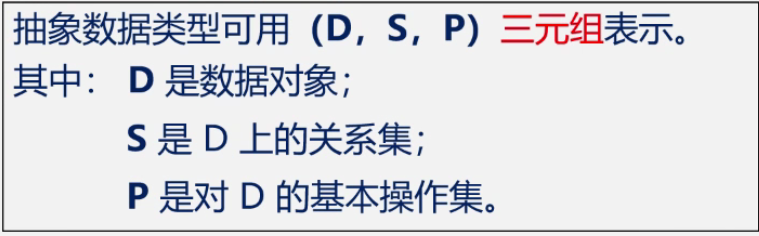
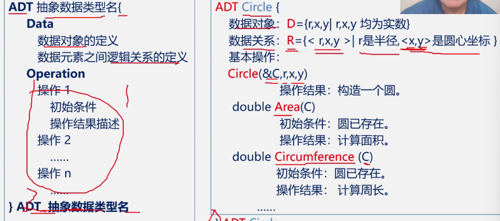
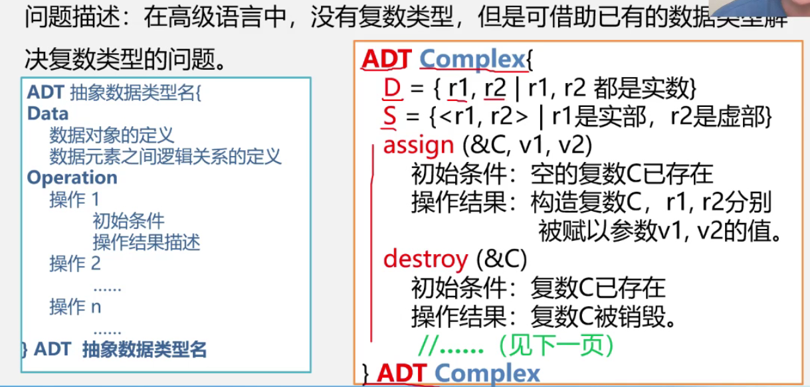
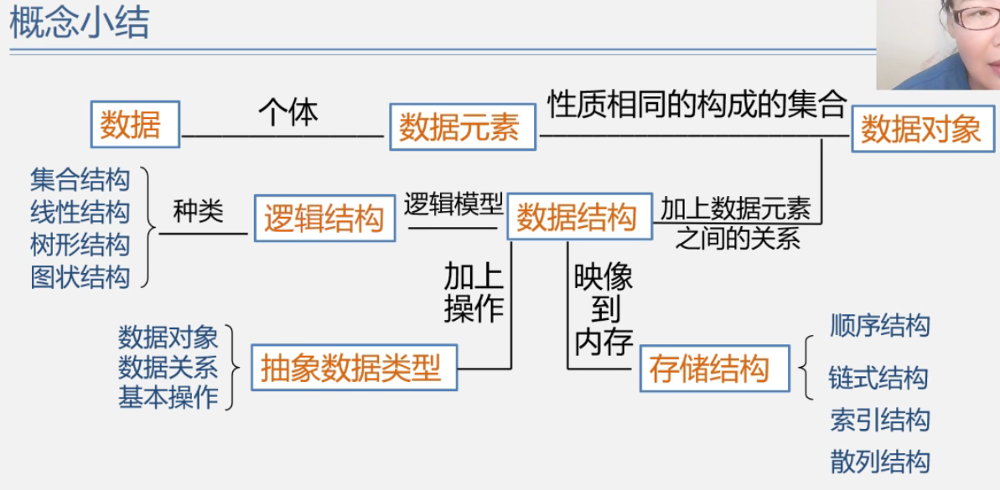

# 数据结构与算法

## 数据、数据元素、数据项和数据对象

### 数据＞数据元素(顶点)＞数据项

数据元素与数据的关系：**是集合的个体**

数据对象与数据的关系：**是数据的子集**

### 数据结构包括

1. 逻辑结构
2. 存储结构
3. 运算和实现

### 逻辑结构有两种划分方式  

第一种分为线性和非线性  

第二种分为四种基本逻辑结构


(集合 线性 树型 图状)

### 存储结构分为四种基本存储结构  

顺序
(连续存储单元  存储顺序表示逻辑关系)
链式
(任意存储单元 用指针表示逻辑关系)
索引
(单独存储一个索引表来表示逻辑结构)
散列
()

---
## 数据类型和抽象数据类型


高级程序设计语言中的**数据类型是在程序设计语言中已经实现了的数据结构。** 是用来约束变量或常量的**取值范围**和**操作**。


### 数据类型（Data Type）：
* **定义**：数据类型是一组性质相同的值的集合以及定义与这个值集合上的一组操作的总称。

    数据类型=值的集合+值集合上的一组操作

### 抽象数据类型（Abstract Data Type,ADT）：
  是指一个数学模型以及定义在此数学模型上的一组操作。
  * 由用户定义，从问题中抽象出数据模型（逻辑结构）
  * 还包括定义在数据模型上的一组抽象运算（相关操作）
  * **不考虑计算机内的具体存储结构与运算的集体实现算法**

#### 抽象数据类型的形式定义


一个抽象数据类型的**定义格式**如下：
定义一个抽象数据类型分为三个部分

```
ADT 抽象数据类型名{
	数据对象:<数据对象的定义>
	数据关系:<数据关系的定义>
	基本操作:<基本操作的定义>
}ADT 抽象数据类型名
```

其中：
> * 数据对象、数据关系的定义用伪代码描述
> * 基本操作的定义格式为：
>   //基本操作部分又分为三个部分
>   * 基本操作名 （参数表）
>   * 初始条件：<初始条件描述>
>   * 操作结果：<操作结果描述> 
>

基本操作定义格式说明：

> 参数表： 
>    赋值参数    只为操作提供输入值。
>    引用参数    以&打头，除可提供输入值外，还将返回操作结果。？？？？？？？？？？？
>
> 初始条件：描述操作执行之前数据结构和参数应满足的条件，若不满足，则操作失败，并返回相应出错信息。若初始条件为空，则省略之。
>
> 操作结果：说明操作组成完成后，数据结构的变化情况和应返回的结果。
>

#### 抽象数据类型（ADT）定义举例：Circle的定义



#### 抽象数据类型（ADT）定义举例：复数的定义

 

#### 用C语言真正实现抽象数据类型的定义
* 例如：抽象数据类型“复数”的实现
```c
//数据对象
typedef struct{
	float realpart;    //实部
	float imagpart;    //虚部
} Complex              //定义实数抽象类型
//数据关系（无）
//基本操作
void assign(Complex *A,float real,float imag);    //赋值
void add(Complex *A,float real,float imag);    //A+B
void minus(Complex *A,float real,float imag);    //A-B
void multiply(Complex *A,float real,float imag);    //A*B
void divide(Complex *A,float real,float imag);    //A/B

void assign(Complex *A,float real,float imag){
    A->realpart = real;
    A->imagpart = imag;
}

	
```
---
## 概念小结



