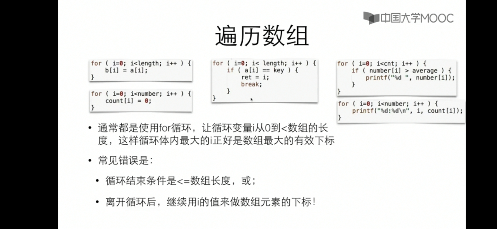

# 数组与指针
## 数组
### 一些小tricks


- 用for遍历数组的时候通常让**循环变量 i 从 0 到小于数组的长度**，这样循环体内最大的i正好是数组最大的有效下标。(离开循环后，不能继续用 i 的值来做数组的下标，因为此时 i 的值为数组长度，越界了。)
- 字符串的本质是字符数组
- 数组的本质是静态指针指向的一片连续储存空间

### 动态内存分配
```c
int *a = (int*)malloc(n*sizeof(int))
```
定义一个长度为n的整型数组，c99之后可以用
```c
int a[n];
```
## 指针
### \*和&是什么东西
- \*号是一个单目运算符，用来访问指针的值所表示的地址上的变量
	例如：
```	c
	 int i = 7;
	 int *p = i;    //(等价于p = &i)
```

- 可以做左值也可以是右值
```c
	int k = *p
	*p = k+1
```
- &号和它一样,也是单目运算符，用来获得变量的地址
### 指针作为参数时
当指针作为函数定义的形参时，如：
```c
void swap(int *a,int *b);
```
回传实参时应该回传**相应类型变量的地址**如：
```c
swap(&i,&j);
```
### 常见错误

```c
	int k;
	int *p;
	int k = 12;
	int *p = 12;
```

指针变量在赋值之前不能使用，因为此时的p中没有任何的地址，故*p不指向任何内容，故不能赋值。

## 数组与指针的区别


数组变量即数组名，其本质是const类型的指针（指针不可修改类型）

```c
int a[];
int* const a;
```

## 指针与const

### 指针是const，指针常量（指针不可修改）
```c
	int *const q = &i;     		//q是const类型
	*q = 26;         			//可以修改指针q所指变量（变量i）的值
	q++;                        //不行
```
- 表示一旦指针得到了某个内容的地址，就不能再指向其他内容（不能改为其他内容的地址）
- 数组变量（数组名）的本质也是指针常量

### 指针所指变量是const，常量指针（不可通过指针修改）
- 表示不能通过指针去修改所指内容（**不会使得所指内容变成const类型**）
```c
	const int *p = &i;
	*p =26;	  	//**不行！(*p)是const**
	i = 26;		//可以
	p = &j;		//可以
```

该方法常用于函数参数声明，可以使得以指针形式传入参数时，避免函数修改指针所指的值
### 二者区别
**判断二者的区别是\*号在const的前面还是后面**

- \*在前为指针的指向不可修改
- const在前为不可通过指针修改指针指向的内容

